# 2.2 ESP32 Easy Coding Board Greeting Robot Projects

## 1. Projects

[Click to download codes](./Code/code.zip).

### 1.1 Servo

A servo is a kind of position driver, which is mainly composed of housing, circuit board, core-less motor, gear and position detector. The receiver or microcontroller sends a signal to the servo which has an internal reference circuit that generates a reference signal with a period of 20ms and a width of 1.5ms, and compares the DC bias voltage with the voltage of the potentiometer to output voltage difference.

There are many specifications of servos, yet all contains three colors of wires: brown, red and orange. Brown is the grounded, red is the positive, and orange is signal. The wire colors may vary from brands.

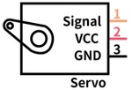

The rotation Angle of the servo is controlled by adjusting the duty cycle of the PWM (pulse width modulation) signals. Theoretically, the period of the standard PWM signal is fixed at 20ms (50Hz), so the pulse width should be 1ms ~ 2ms. But in fact, it is 0.5ms ~ 2.5ms, corresponding to the servo angle of  0° ~ 180°.

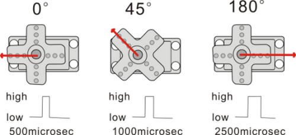

**1.1.1 Parameters**

Operating voltage: DC 3.3 ~ 5V

Operating Angle range: approx. 180°(at 500→2500 μsec)

Pulse width: 500→2500 μsec

No load speed: 0.12± 0.01sec /60 (DC 4.8V)        0.1± 0.01sec /60 (DC 6V)

No load current: 200±20mA (DC 4.8V)         220±20mA (DC 6V)

Stopping torque: 1.3±0.01kg·cm (DC 4.8V)          1.5±0.1kg·cm (DC 6V)

Stop current: ≦850mA (DC 4.8V)           ≦1000mA (DC 6V)

Standby current: 3±1mA (DC 4.8V)           4±1mA (DC 6V)

**1.1.2 Wiring Diagram**

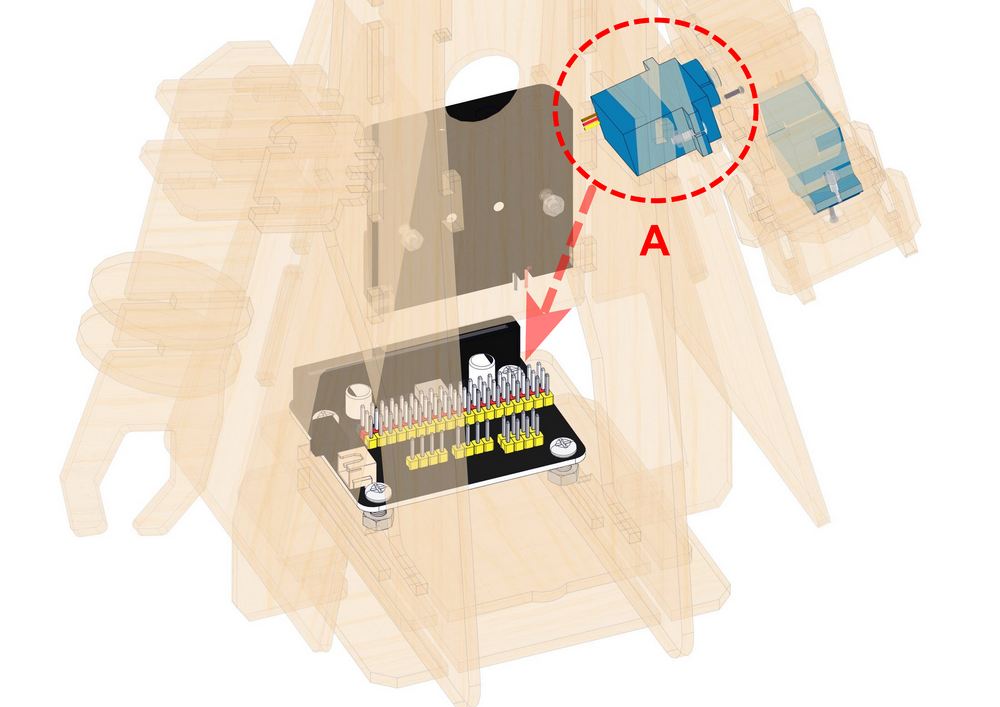

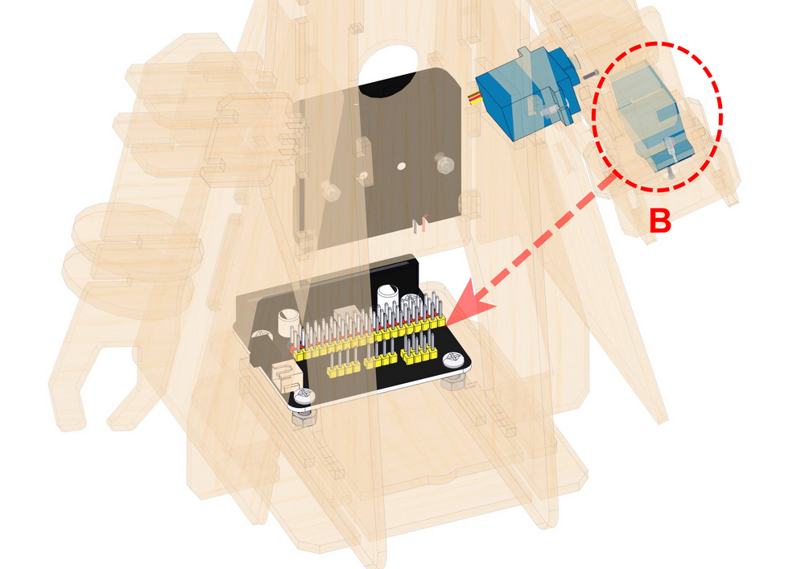

------

| Expansion board |  Servo A   |
| :-------------: | :--------: |
|       GND       | G (brown)  |
|       3V3       |  V (red)   |
|    P0 / io12    | S (yellow) |

| Expansion board |  Servo B   |
| :-------------: | :--------: |
|       GND       | G (brown)  |
|       3V3       |  V (red)   |
|    P1 / io14    | S (yellow) |

**1.1.3 Test Code**

ATTENTION: The servo is able to rotate from 0 to 180 degrees. Yet after assembly, it can only move within 0-90 degrees. Otherwise, it may burn out due to stuck and overheating.

[**Click to download codes**](./Code/code.zip).

**Build code blocks manually:**

1\. Click  and choose `Actuator`, find `Servo` and click to load it.

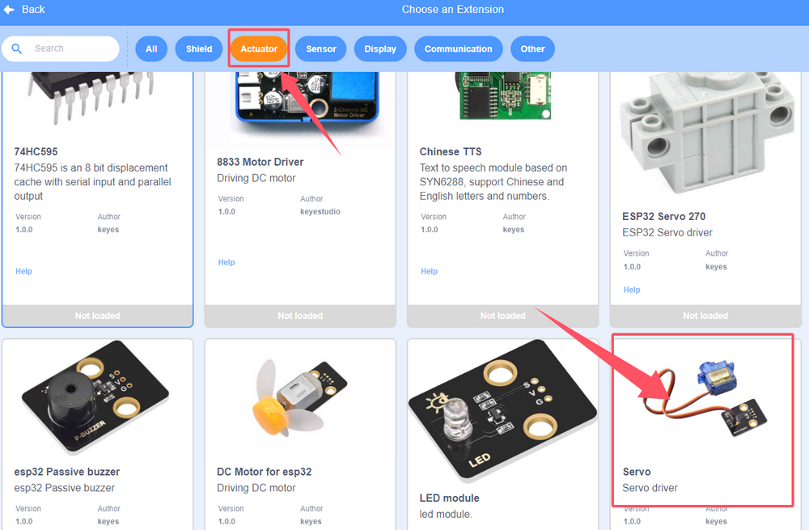

If you see Loaded, the extension is successfully imported, and then click .

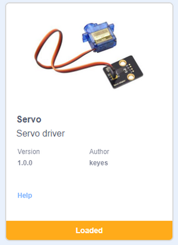

2\. In , add a .

3\. In , drag a  and put it under .

4\. In , add a , set the pin to `IO12`, angle to 0 degree and delay to `1000`(ms), and put it into .

5\. In , add one more , set pin to `IO12`, angle to 90 degrees and delay to `1000`(ms), and put it under the previous one.

**Complete code:**

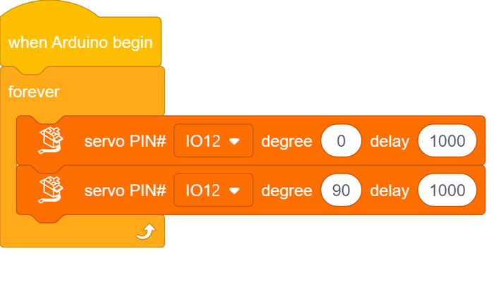

**1.1.4 Test Result**

The arm of the greeting robot moves.

------

### 1.2 Waving Arm

We combine two servos to make the robot to do some actions.

**1.2.1 Test Code: Left-turn** 

1\. In , add a .

2\. In , put  under .

3\. In , add a , set the pin to `IO12`, angle to `0` degree and delay to `1000`(ms), and put it under .

4\. In , add a , set the pin to `IO14`, angle to `0` degree and delay to `1000`(ms), and put it into .

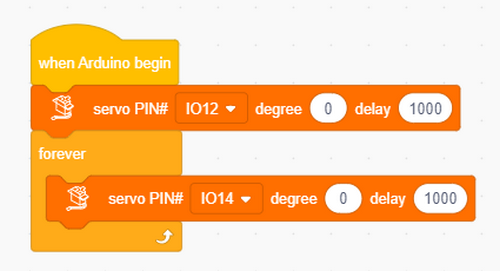

5\. Repeat the above steps but set pin io14 to 90°.

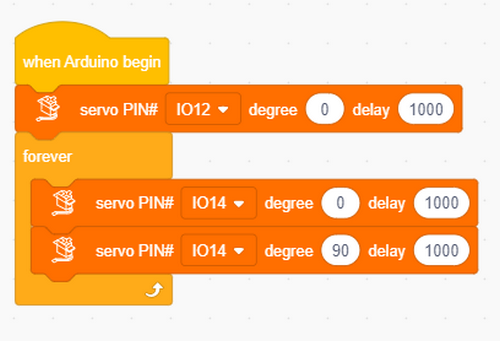

**1.2.2 Result**

The palm of the greeting robot turns left.

------

**1.2.3 Test Code: Greeting**

1\. In , add a .

2\. In , put  under .

3\. In , add a , set the pin to `IO12`, angle to `90` degree and delay to `1000`(ms), and put it under .

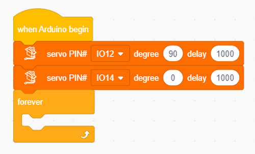

4\. In , add a , set the pin to `IO14`, angle to `0` degree and delay to `1000`(ms), and put it into .

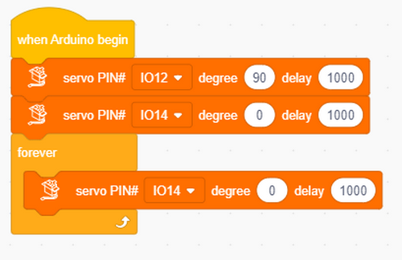

5\. Repeat the above steps but set pin io14 to 90°.

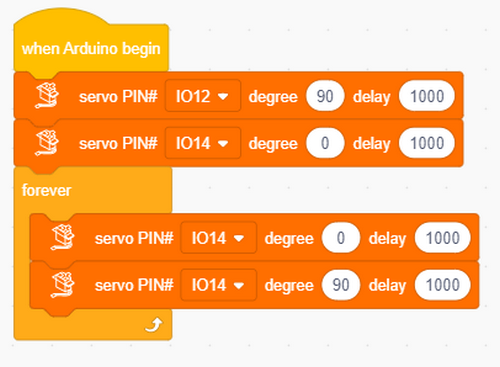

**1.2.4 Result**

The robot put its arms up and wave its hand for welcome.

------

### 1.3 Ultrasonic

Before learning: In this project, we introduce the fundamentals of ultrasound. We will use the ultrasonic sensor to print detected distances on the serial monitor.

**1.3.1 Overview**

Like bats, HC-SR04 ultrasonic sensor uses sonar to determine the distance to an object. It provides excellent contact-less range inspection with high accuracy and stable readings. It is also equipped with ultrasonic transmitter and receiver. It is widely applied to electronics projects for obstacle detection and distance measurement.

**1.3.2 Module Parameters**

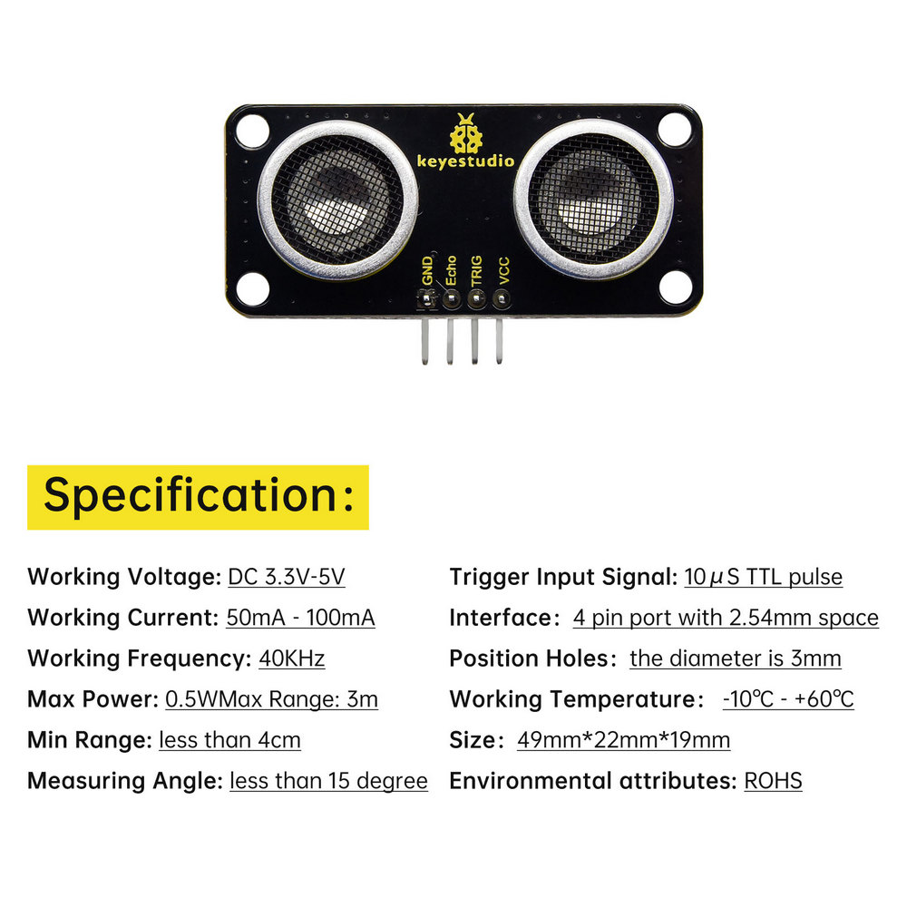

**1.3.3 Wiring Diagram**

| Expansion board | Ultrasonic sensor |
| :-------------: | :---------------: |
|       3V3       |        VCC        |
|      TRIG       |     P12/io15      |
|      ECHO       |      P8/io4       |
|       GND       |        GND        |

**1.3.4 Test Code**

Add an Extension.

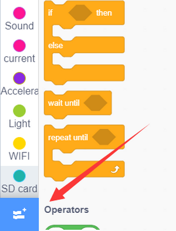

Search **ULTRASONIC**.

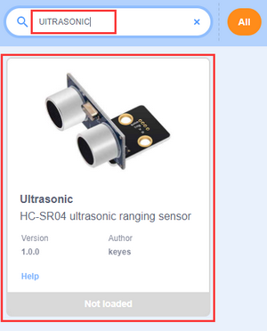

Click to load it.

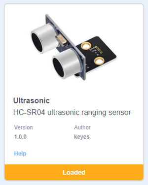

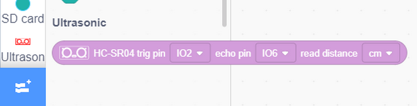

Initialize the serial port.

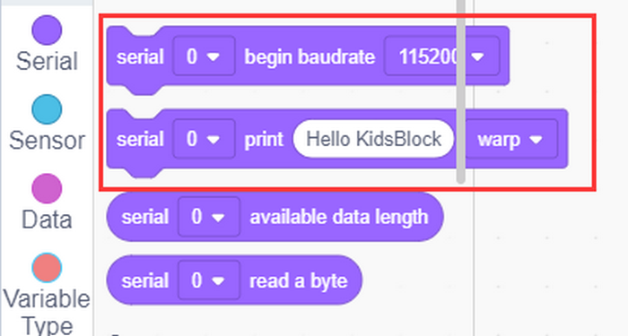

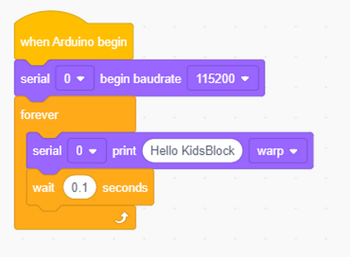

Add the code block of the ultrasonic sensor.

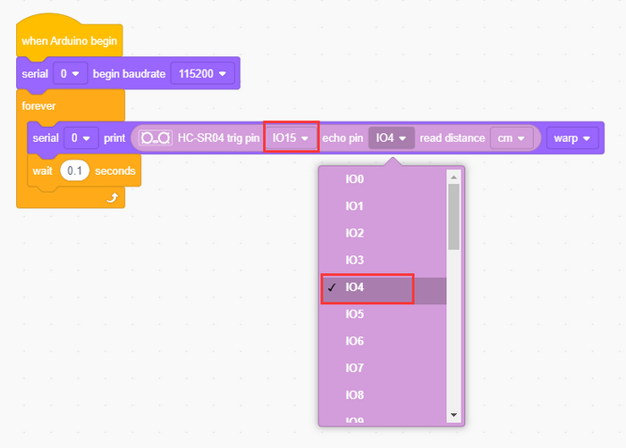

**Complete code:**

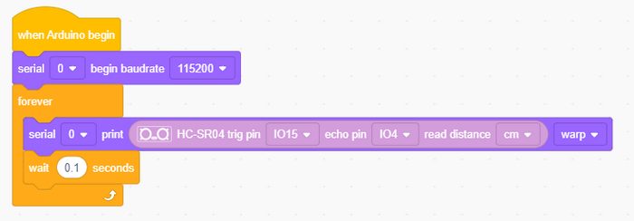

**1.3.5 Test Result**

Open the serial monitor and set the baud rate. NOTE that the sensor is not professional and just used for learning.

Put an object in front of the ultrasonic sensor, and it will detect the corresponding distance value. 

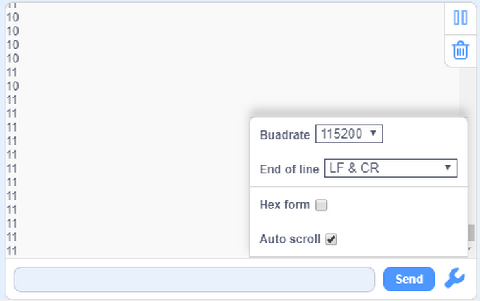

------

### 1.4 Greeting Robot

Before learning: We combine the servos and ultrasonic sensor in this project. When the sensor detects any thing within the distance of 15~35CM, the greeting robot waves its arm as a welcome.

**1.4.1 Test Code**

1\. Click  to make a variable to store the detected distance value.

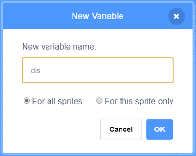

2\. Assign the detected distance value to the variable. 

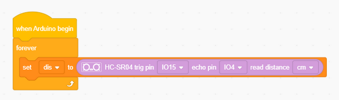

3\. Set servo connected to pin io12 and io14 to angle 0°.

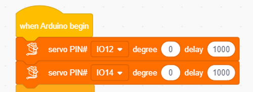

4\. In , add a 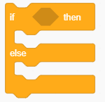 into .

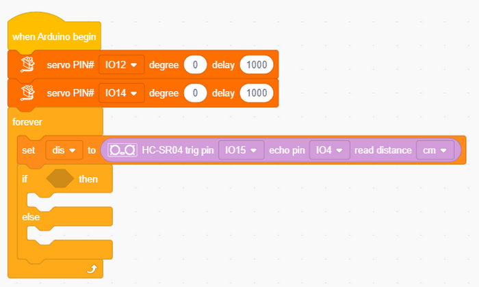

5\. Put  and  into  in sequence. 

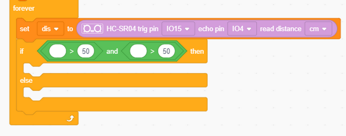

When the ultrasonic sensor detects object(s) with the distance of 15~35CM;

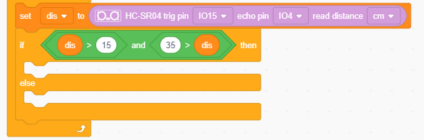

io12 servo is set to 90°, and io14 servo rotates within 0~90° to wave the arm.

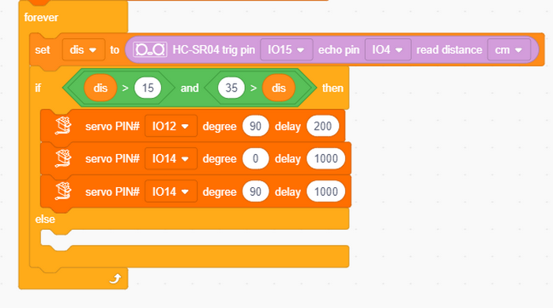

Or else, the robot stops waving its hand and put his arm to the original position. 

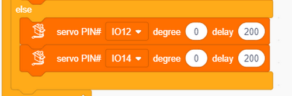

**Complete code:**

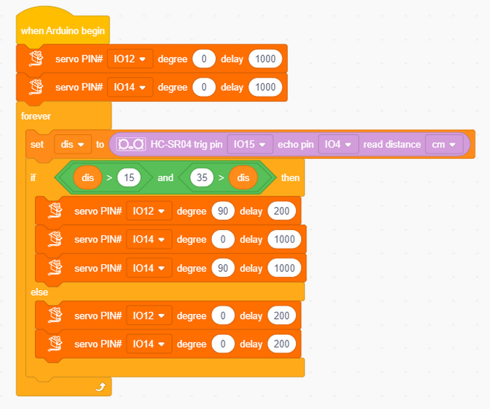

**1.4.2 Test Result**

When someone approaches, the robot begins to greet him/her.

------

## 2. FAQ

### Q: Battery model?

A: Four AAA batteries. Please install the batteries in the correct direction rather than reverse them! For younger students, please be accompanied by your parents!

------

### Q: Error occurs when burning programs on ESP32 board?

A: 

- Please check whether the USB port number is correct.
- Please ensure the main board model is available. 

------

### Q: Expand to external modules?

A: It can expand to external modules. For details, please follow the ESP32 pin instructions to ensure external modules can normally work.

------

## 3. Resources

Keyestudio official:

[https://www.keyestudio.com/](https://www.keyestudio.com/)

Keyestudio wiki main page:

[https://wiki.keyestudio.com/Main_Page](https://www.keyestudio.com/)

Arduino official:

[https://www.arduino.cc/](https://www.keyestudio.com/)

ESP32 espressif official:

[https://www.espressif.com/](https://www.keyestudio.com/)
