# Keyestudio ESP32 Easy Coding Board Software Tutorial


## 1. Brief Description

Keyestudio ESP32 Easy Coding Board is an open source instructional application board equipped with 520KB dynamic memory, 4MB flash memory and 240MHz dual-core processor to easily run a variety of real-time operating systems such as freeRTOS. Its low-power Bluetooth and WiFi capabilities are excellent for wireless communication.

Its powerful functions and configurations are useful in a variety of areas, including but not limited to STEAM teaching, IOT, smart control projects, as well as DIY creative works.

The Board integrates multiple sensors for projects without any external device. The on-board temperature and humidity sensor monitors the indoor and outdoor ambient temperature and humidity in real time; the six-axis acceleration gyroscope obtains the motion posture and acceleration for motion sensing; the photoresistor captures the intensity of ambient light; SD card interface saves the detected data; microphone detects ambient sound, and the buzzer plays music. Button A and B, 7 touch button can be used as switches or triggers. At last, the 5*5 RGB matrix with endless dimming, displays numbers, letters and patterns.


ESP32 board provides gold-finger expansion, including all IO ports, 19 digital channels, 7 analog channels, which support I2C, UART, SPI and other interfaces.


In addition, it supports many programming languages, like Arduino, MicroPython and KidsBlock3.0 graphical programming. It is also compatible with the development environment of other boards and is suitable for users at different programming levels.

**Compared with Micro:bit board:**

|                   |                                            |                                           |
| :---------------: | :----------------------------------------------------------: | :----------------------------------------------------------: |
|       Name        |                   ESP32 Easy Coding Board                    |                         Micro:bit V2                         |
| Recommended group |               primary, junior, **senior** high               |                     primary, junior high                     |
|     Processor     |                       **ESP-WROOM-32**                       |                        nRF52833-QIAA                         |
|    Dimensions     |                           52*51mm                            |                           52*43mm                            |
|  Memory capacity  |                 **SRAM:520KB<br>Flash:4MB**                  |                  SRAM:16KB<br/>Flash:256KB                   |
| Support language  |             KidsBlock3.0<br>C/C++<br>microPython             |             JavaScript<br/>C/C++<br/>microPython             |
|     I/O ports     | 19 digital I/O ports<br>6 analog input ports<br>**13 PWM ports** |        19 digital I/O ports<br/>6 analog input ports         |
|   Communication   |     1. Bluetooth Low Energy 4.2<br/>**2. wireless Wifi**     |                     Bluetooth Low Energy                     |
| On-board function | 1. 2-channel button<br>**2. 7-channel touch input<br/>**3. 3-axis acceleration<br/>4. 3-axis gyroscope<br/>5. light sensor<br/>**6. 5*5 RGB matrix<br/>7. temperature and humidity sensor<br>8. SD card module<br/>9. passive buzzer<br/>10. mini microphone<br/>11. power supply detection**<br/>**12. I2C interface (2.54 headers)** | 1. 2-channel button<br/>2. 3-channel touch input<br/>3. 3-axis acceleration<br/>4. 3-axis magnetometer<br/>5. light sensor<br/>6. 5*5 LED matrix<br/>7. temperature sensor |
|   Introductory    |                            ★★★★★                             |                            ★★★★★                             |
|  Practicability   |                            ★★★★★                             |                              ★★                              |
|   Extensibility   |                             ★★★★                             |                             ★★★                              |


## 2. Technical Specifications

- Power supply: USB power, DC power (PH2.0), Goldfinger I/O port power

- Operating voltage: 3.3V

- Operating current: 100mA

- ESP32 main control:
  - Processor: ESP32-D0WDQ6 (dual-core)
  - Main frequency: up to 240MHZ
  - SRAM: 520KB
  - Flash: 4MB
  - WiFi protocol: 802.11 b/g/n (802.11n, speed up to 150 Mbps)
  - WiFi operating frequency range: 2412 ~ 2484 MHz
  - Bluetooth protocol: Compliant with Bluetooth v4.2BR /EDR and BLE standards
  - Bluetooth RF: NZIF receiver with -97 dBm sensitivity
  - Bluetooth audio: CVSD and SBC audio

- On-board resources:
  - 2-way digital buttons (A and B)
  - MPU6050 Six-axis acceleration gyroscope
    - Maximum rotation speed: 2000°/s
    - Acceleration range: ±2g, ±4g, ±8g, ±16g
  - Light sensor: phototransistor ALS-PT19-315C
  - Microphone: 4013-SMD
  - Buzzer: MLT-8530AAC3V
  - 25 RGB: WS2812-2020 RGB-LED
  - Temperature and humidity sensor: AHT20
  - SD card expansion interface
  - Power detection module: INA180A1IDBVR
  - I2C expansion port (2.54 headers)
- Extension interfaces:
  - 19-channel digital I/O (partially multiplexed with on-board resources)
  - two 8-bit DAC (io25, io26)
  - 7 touch pins (io2, io4, io12, io13, io15, io27, io32)
  - 13 PWM pins (io2, io4, io5, io12, io15, io16, io18, io19, io23, io25, io26, io27, io32)
  - 3-channel UART device (any pin), support for hardware flow control and DMA
  - 2-channel I2C devices (any pin), support master/slave mode
  - Infrared remote control (any pin) 8-channel IR transceiver, support different waveform standards.

## 3. Programming

### 3.1. Arduino

Main interface:


#### Arduino IDE Download/Installation/Using

##### A. Windows

Step 1: visit Arduino official: [https://www.arduino.cc/](https://www.arduino.cc/)

Step 2: Click “**SOFTWARE**”.


Step 3: choose an appropriate version. Here we demonstrate on Windows. 

Click “**Windows** win 10 and newer 64 bits” 


Step 4: Click “**JUST DOWNLOAD**”


Step 5: the .exe file we have downloaded:


Step 6: choose “arduino-ide_2.2.1_Windows_64bit.exe” and “**Open**”


Step 7: “**I Agree**”


Step 8: “**Next**”


Step 9: ①click “**Browse..**” to choose a path for Arduino IDE; ②“**Install**”


Step 10: wait.


Step 11: tick “**Run Arduino IDE**” and “**Finish**”


##### B. MAC

Similar to Windows, choose an appropriate version to install.


#### Board Driver

##### Install CH340 Driver on WIN System

Driver download: [https://fs.keyestudio.com/CH340-WINDOWS](https://fs.keyestudio.com/CH340-WINDOWS)

Windows 10 (and later systems) boasts their own drivers, so there is no need to install additional drivers.

Connect the control board to your computer. Click Computer-- Properties -- Device Manager, as shown below. This indicates a successful connection, so the installation of driver is not required. 


If the following situation occurs, you need to manually install the driver.


Click 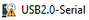to select “Update driver”. And then the driver will start to install. 


Tap "Browse my computer for drivers".


Find the downloaded “usb_ch341_3.1.2009.06” or “cp210x“ and click Next.


After finishing installing, click "Close" and the serial port number will show up. 


The driver is successfully installed! Click Computer-- Properties -- Device Manager to check: 


##### Install CH340 Driver on MAC System

**Step 1**: Download the driver from the Website and extract the file to the local installation directory.


**Step 2**: For details about how to install the driver in pkg format by default, see Step 3. If OS X 11.0 or later does not support Rosetta, refer to Step 4 to install the dmg driver.

Before installation, please forward to “System Preferences” -> “Security & Privacy” -> “General” page, below the title “Allow apps downloaded from:” choose the choice 2 -> “Mac App Store and identified developers”, then the driver will work normally.


**Step 3**: To install the driver in pkg format, tap the driver file → Continue→ Install

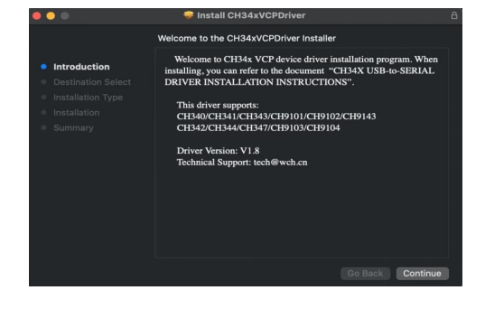


Then the installation will be successful.


To install the pkg format driver on OS X 11.0 and later: Open “LaunchPad” → “CH34xVCPDriver” → Install.


When using OS X 10.9 to OS X 10.15, click “Restart” to restart your computer, and perform the following steps after the restart.


**Step 4**: To install the dmg driver, tap the dmg file and drag “CH34xVCPDriver” to enter the application folder in the operating system.


Then open “LaunchPad” → “CH34xVCPDriver” → Install.


Then the installation will be successful.


When inserting the CH340 control board into the USB port, open System Report -> Hardware ->USB. On the right is USB Device Tree. If the USB device is working properly, you will find a device whose “Vendor ID” is [0x1a86].


Open “Terminal” program under Applications-Utilities folder and type the command “ls /dev/tty*”.


You should see the “tty.wchusbserialx” where “x” is the assigned device number similar to Windows COM port assignment.

------

####  Arduino IDE on ESP32 Board

##### Windows

In arduino IDE “Tools”——>“Board”, there is no ESP32 board, because we have not loaded it yet. 

Install ESP32:

Open Arduino IDE, click “**File** ——>**Preferences**”, and copy and paste the link in Additional boards manager URLs: https://espressif.github.io/arduino-esp32/package_esp32_index.json. And click OK


Choose the board icon.


Search ESP32 to install the latest version. **During installation, please ensure that the network is stable. If the installation fails, reinstall it.**


Choose corresponding ESP32 board model.


Choose the correct COM port. You can check it in Device Manager. If there are a lot of COM ports and you do not know which one is correct, unplug the development board and a COM port will disappear. And this is the required port. If there is no COM, please check whether the driver is installed.


Herein, our COM port is COM3, so we choose “Tools”→ “Port”→ “COM3”.


After that, try an example code that prints “Hello Keyestudio!” per second on the serial monitor.

Here is the code:

```c
/*
  keyestudio 
  Print “Hello Keyestudio!”
  http://www.keyestudio.com
*/
void setup() {  
    // put your setup code here, to run once:
    Serial.begin(9600);  //Set the serial port baud rate to 9600
}

void loop() {  
    // put your main code here, to run repeatedly:
    Serial.println("Hello Keyestudio!");  //Serial port printing
 	delay(1000);  //Delay of 1 second
}
```


Click  to upload the code and you will see: 


If “————……..————……..” appears, please press the on-board “**Boot**” button. This is a solution for only Keyestudio ESP32 development board (excluding Keyestudio Plus ESP32).

Click  to open the serial monitor and set baud rate to 9600, and you can see “Hello Keyestudio!”


1. “Toggle Autoscroll”: Set whether the print window follows printing
2. “Toggle Timestamp”: Set whether to display print time
3. “Clear Output”: Clear data in the print window
4. Serial input box
5. Serial transmission format
6. Set the baud rate, click to select the baud rate
7. print box

Here is all of uploading, please return to the main tutorial to learn how to add libraries. Without library, IDE will report an error.

##### MAC

Install ESP32:

Open Arduino IDE and click “**Arduino IDE** ——>**Preferences**”. Copy and paste the link in Additional boards manager URLs: https://espressif.github.io/arduino-esp32/package_esp32_index.json. And click OK.


Choose the board icon.

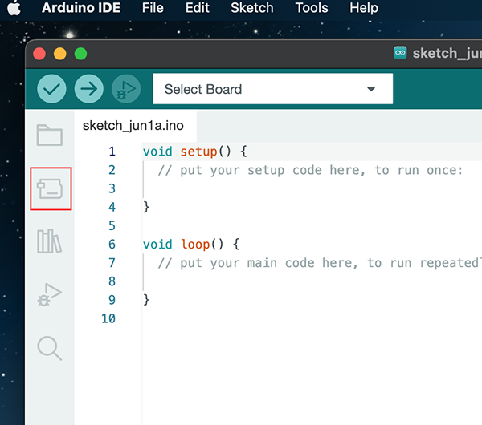

Search ESP32 to install the latest version. **During installation, please ensure that the network is stable. If the installation fails, reinstall it.**


Successfully installed: 


Choose corresponding ESP32 board model.


Choose the correct COM port. You can check it in Device Manager. If there are a lot of COM ports and you do not know which one is correct, unplug the development board and a COM port will disappear. And this is the required port. If there is no COM, please check whether the driver is installed.

In “Tools”–>“Port”, choose “/dev/cu.usbderial-0001”.


After that, try an example code that prints “Hello Keyestudio!” per second on the serial monitor.


Here is the code:

```c
/*
  keyestudio 
  Print “Hello Keyestudio!”
  http://www.keyestudio.com
*/
void setup() {  
    // put your setup code here, to run once:
    Serial.begin(9600);  //Set the serial port baud rate to 9600
}

void loop() {  
    // put your main code here, to run repeatedly:
    Serial.println("Hello Keyestudio!");  //Serial port printing
 	delay(1000);  //Delay of 1 second
}
```

Click  to upload the code and you will see: 


If “————……..————……..” appears, please press the on-board “**Boot**” button. This is a solution for only Keyestudio ESP32 development board (excluding Keyestudio Plus ESP32).

Click  to open the serial monitor and set baud rate to 9600, and you can see “Hello Keyestudio!”

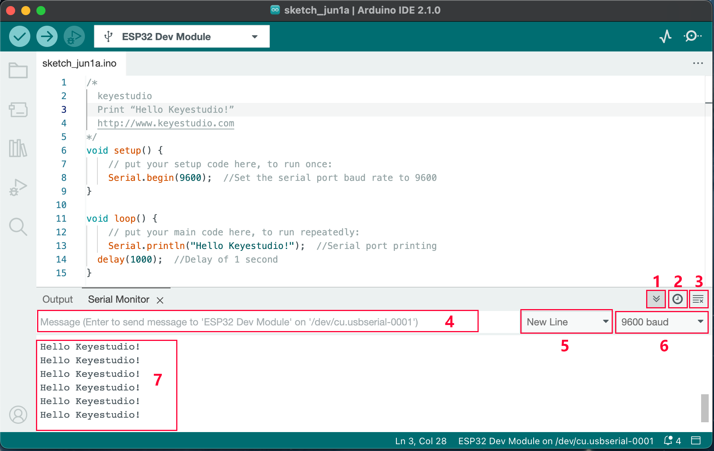

1. “Toggle Autoscroll”: Set whether the print window follows printing
2. “Toggle Timestamp”: Set whether to display print time
3. “Clear Output”: Clear data in the print window
4. Serial input box
5. Serial transmission format
6. Set the baud rate, click to select the baud rate
7. print box

Here is all of uploading, please return to the main tutorial to learn how to add libraries. Without library, IDE will report an error.


------

### 3.2. MicroPython

Main interface:


#### Download and Install Thonny

Thonny is a free and open source software platform with small size, simple interface, simple operation and rich functions. It is a Python IDE suitable for beginners. In this tutorial, we use this IDE to develop a ESP32. Thonny supports multiple operating systems including Windows, Mac OS, Linux.

##### Download Thonny:

1). Enter the website：[https://thonny.org](https://thonny.org) to download the latest version of Thonny.

2). Thonny open-source code library：[https://github.com/thonny/thonny](https://github.com/thonny/thonny).

<table class="colwidths-auto docutils align-default">
<tbody>
<tr class="odd">
<td>System</td>
<td>Download link</td>
</tr>
<tr class="even">
<td>MAC OS：</td>
<td><a href="https://github.com/thonny/thonny/releases/download/v3.2.7/thonny-3.2.7.pkg">https://github.com/thonny/thonny/releases/download/v3.2.7/thonny-3.2.7.pkg</a></td>
</tr>
<tr class="odd">
<td>Windows：</td>
<td><a href=" https:/github.com/thonny/thonny/releases/download/v3.2.7/thonny-3.2.7.exe">https://github.com/thonny/thonny/releases/download/v3.2.7/thonny-3.2.7.exe</a></td>
</tr>
<tr class="even">
<td>Linux：</td>
<td><p>Latest version:</p>
<p><strong>Binary bundle for PC (Thonny+Python):</strong></p>
<p>bash &lt;(wget -O - https://thonny.org/installer-for-linux)</p>
<p><strong>With pip:</strong></p>
<p>pip3 install thonny</p>
<p><strong>Distro packages (may not be the latest version):</strong></p>
<p><strong>Debian, Rasbian, Ubuntu, Mint and others:</strong></p>
<p>sudo apt install thonny</p>
<p><strong>Fedora:</strong></p>
<p>sudo dnf install thonny</p></td>
</tr>
</tbody>
</table>


##### Install Thonny (Windows System):

1). The downloaded Thonny icon is as follows:


2). Double-click“thonny-3.3.13.exe”and select install mode. You can choose 


3). You can also keep selecting **Next** to finish install.


4). If you want to change the route of installing Thonny，just click“**Browse...**”to select a new route and click **OK**.


5). Click **Create desktop icon,** you will view Thonny on your desktop.


6). Click“**Install**”


7). Wait for a while but don’t click **Cancel**


8). Click **“Finish”**


##### Basic Setting:

Double-click Thonny, choose lanuage and initial settings and click **Let’s go！**


Click“**View**”→“**File**”and“**Shell**”


####  Install CH340 Driver

##### Windows System

Download: [https://fs.keyestudio.com/CH340-WINDOWS](https://fs.keyestudio.com/CH340-WINDOWS)

Windows 10 (and later systems) boasts their own drivers, so there is no need to install additional drivers.

Connect the control board to your computer.

Click Computer-- Properties -- Device Manager, as shown below. This indicates a successful connection, so the installation of driver is not required. 


If the following situation occurs, you need to manually install the driver.


Click to select “Update driver”. And then the driver will start to install. 


Tap "Browse my computer for drivers".


Find the file **usb_ch341_3.1.2009.06** or **cp210x** you have downloaded, and click "Next".


After finishing installing, click "Close" and the serial port number will show up. 


The driver is successfully installed!

Click Computer-- Properties -- Device Manager to check: 


##### MAC System

**Step 1**: Download the driver from the Website and extract the file to the local installation directory.


**Step 2**: For details about how to install the driver in pkg format by default, see Step 3. If OS X 11.0 or later does not support Rosetta, refer to Step 4 to install the dmg driver.

Before installation, please forward to “System Preferences” -> “Security & Privacy” -> “General” page, below the title “Allow apps downloaded from:” choose the choice 2 -> “Mac App Store and identified developers”, then the driver will work normally.


**Step 3**: To install the driver in pkg format, tap the driver file → Continue→ Install


Then the installation will be successful.


To install the pkg format driver on OS X 11.0 and later: Open “LaunchPad” → “CH34xVCPDriver” → Install.


When using OS X 10.9 to OS X 10.15, click “Restart” to restart your computer, and perform the following steps after the restart.


**Step 4**: To install the dmg driver, tap the dmg file and drag “CH34xVCPDriver” to enter the application folder in the operating system.


Then open “LaunchPad” → “CH34xVCPDriver” → Install.


Then the installation will be successful.


When inserting the CH340 control board into the USB port, open System Report -> Hardware ->USB. On the right is USB Device Tree. If the USB device is working properly, you will find a device whose “Vendor ID” is [0x1a86].


Open “Terminal” program under Applications-Utilities folder and type the command “ls /dev/tty*”.


You should see the “tty.wchusbserialx” where “x” is the assigned device number similar to Windows COM port assignment.

#### Burn Micropython Firmware

MicroPython firmware is required to operate on ESP32.

##### Download Micropython Firmware

microPython official: http://micropython.org/

microPython ESP32 firmware: https://micropython.org/download/esp32/


The firmware used in this tutorial is **esp32-20210902-v1.17.bin**.

[Click to download the firmware directly](https://micropython.org/resources/firmware/esp32-20220117-v1.18.bin).

We also provided in the tutorial:


##### Burn Micropython Firmware

Connect the board to computer after installing driver.


Check “Ports”.


COM number may vary from computers.

1. open Thonny, choose “Run” and “Select interpreter...”


2. Set interpreter to “Micropython (ESP32)”, choose port to “Silicon Labs CP210x USB to UART Bridge(COM3)” and click “Install or update firmware”.

   

3. Set “Port” to “Silicon Labs CP210x USB to UART Bridge(COM3)”. Click “Browse...” to open microPython firmware ***esp32-20210902-v1.17.bin***. 

   

   

   Check “Erase flash before installing” and “Flash mode”, and then “Install”. If the firmware installation fails, press and hold the Boot button on the ESP32 and click “Install”.

   

4. After that, “Close” and “OK”.

   

   

   

5. Back to main interface and click “STOP”.

   

#### Test

##### Test Shell Command

Input “print('hello world')” in “Shell” and press Enter.


##### Test Online Running

ESP32 needs to be connected to a computer when it is running online. You can use Thonny to write and debug programs.

1. Open Tonny and click “Open”.

   

2. Choose “This computer”.

   

   Choose to open “code Hello World”.

   

   Click “Run current script”, and “Hello World” will be printed on “Shell”.

   

   When running online, if the reset button on the ESP32 is pressed, the code will not be executed again. If you want to run the code automatically after you reset it, please refer to Running offline below.

##### Test Offline Running

After the ESP32 is reset, first run the boot.py file in the root directory, then run your code file, and finally go to "Shell". Therefore, in order for ESP32 to execute user code after reset, we need to add a boot program to execute user code in boot.py.

1. Move **code Hello World** into disk(D): “D:/code Hello World”. Open “Thonny”.
	
	
	
	
	
2. Double-click boot.py to run code offline on “MicroPython device”.

	
	
	
	

If you want to make your program run offline, you need to upload boot.py and your program to the “MicroPython device” and then press the reset button on the ESP32. Here we take code Hello World as an example. Select boot.py and right-click to select “Upload to /”.


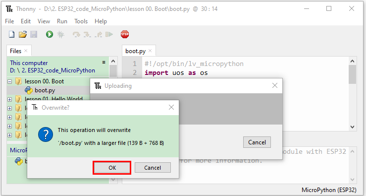

Similarly, Upload code Hello World.py to  “MicroPython device”.


3. Press the Reset button and you can see the code is executed in “Shell”.


------

### 3.3. KidsBlock3.0

Main interface:


#### 1.1 Kidsblock Installation

##### Windows

1. Download

   - Download Kidsblock package: [http://xiazai.keyesrobot.cn/KidsBlock.exe](http://xiazai.keyesrobot.cn/KidsBlock.exe)

   -  

2. Click “KidsBlock Desktop.exe”. 

3. Tick “**Anyone who uses this computer(all users)**” and click “**Next**”.


4. Click “**Browse...**” to choose a path for the software (here we choose Disk C) and then “**Install**”.


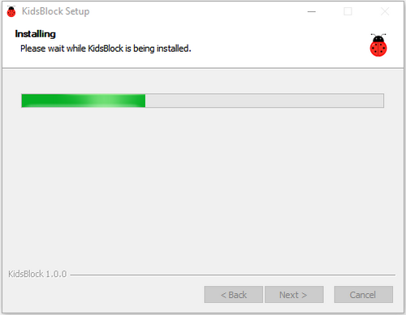

5. Click “Finish” and open Kidsblock.


6. If a warning interface pops up, just “**Allow access**”. 


------

##### MacOS

1. Download Kidsblock package: [http://xiazai.keyesrobot.cn/KidsBlock.dmg](http://xiazai.keyesrobot.cn/KidsBlock.dmg)


2. After downloading, Click KidsBlock. Drag the icon of KidsBlock Desktop into Applications.


3. After installation, you can see the icon of KidsBlock.

   

4. If you cannot open KidsBlock, we need to configure the settings of you MAC.

   

5. Choose Privacy & Security, tick “App Store and identified developers”.

   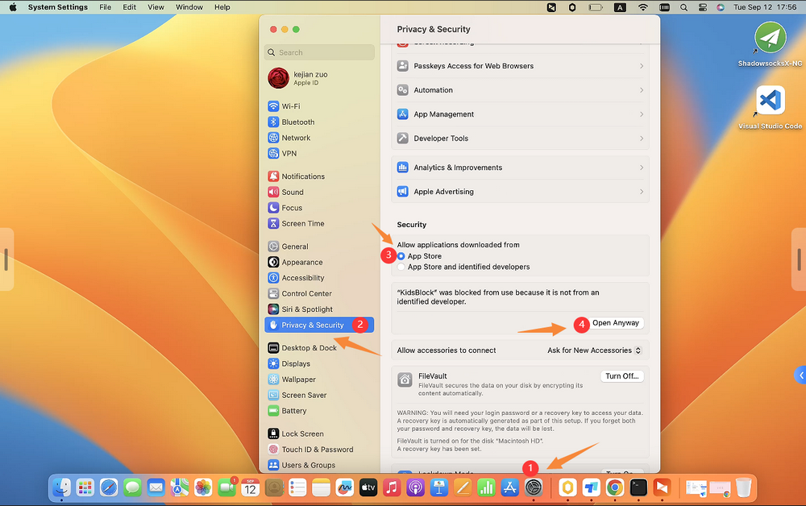

6. “Open” again.

   

7. And the Kidsblock is loading.

   

8. Now enjoy your Programming journey!

   

------

#### 1.2 Using Tutorial

(**Here we demonstrate on Windows, and it can be a reference for MacOS.**)

##### Main Interface Functions 1


------

##### Languages

Click  to choose “English” or “简体中文”

------


##### Driver

**NOTE: If the driver has already installed on your computer, please skip the following steps.**

- Click  and “**Install driver**”


- Welcome to the Device Driver Installation Wizard and click “**Next**”.


- “**Finish**”

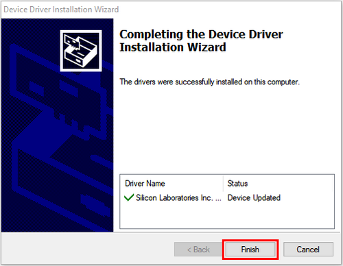

- “**Next**”


- “**Finish**”


- If a warning interface pops up, just “**Allow**”. And then click “**Install**”.


- “**Finish**”


- “**Extract**”


- “**Next**”

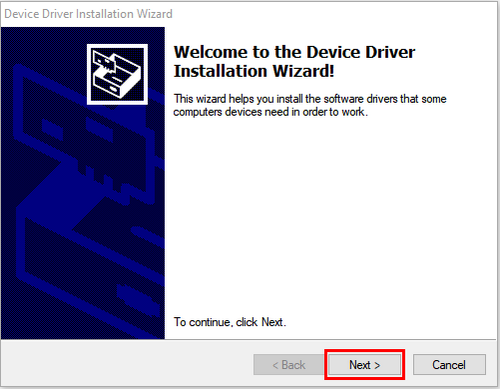

- Tick “**I accept this agreement**”, “**Next**”


- “**Finish**”


- “**INSTALL**”


- Click “**OK**” and the driver is successfully installed.

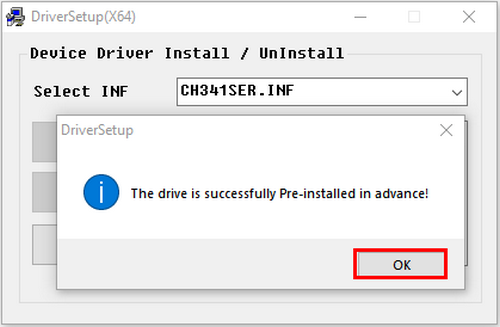

------

##### Development Board

Choose board and port.

- Click  to choose a control board. 

- Choose **Kit** and **ESP32 Easy Coding Board**. All sensors are integrated so you do not need to import additionally. 

  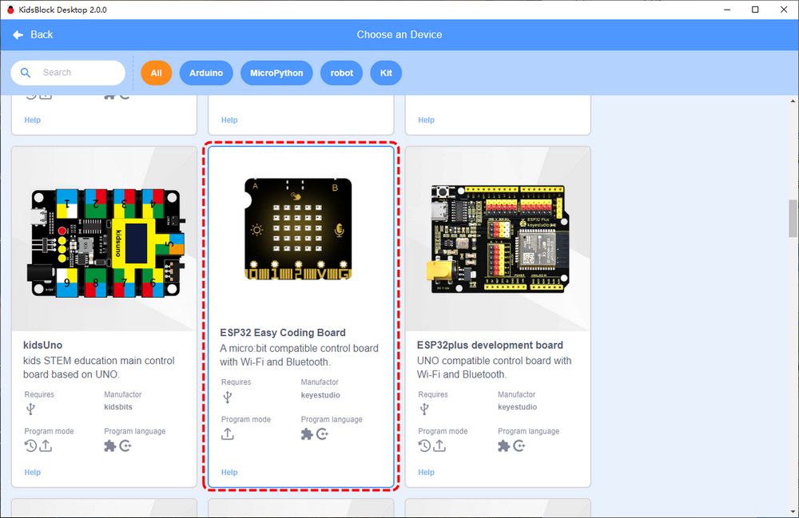

- Choose the correct port and **Connect**.

  

- **Go to Editor**

  

- Main interface:

  

------

Disconnection:

- Click 

- Click **Disconnect**.

  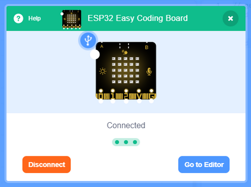

------

##### Main Interface Functions 2


------

##### Extensions

**NOTE: All required modules are integrated in main board, so this section is for reference.**

- Extensions: 

- Sensors and modules:

  

- For instance, click “passive buzzer”

  

- “**Not loaded**” changes into “**Loaded**”. Passive buzzer is added.

  

- Click to back to editor, and you will see the Passive buzzer block.

  

- If you want to remove it, enter  and click the module again to delete this extension.

- Click “passive buzzer”.

  

  “Loaded” changes into “Not loaded”. That means this block is removed. 

  

  


------

##### Load Code

1. **Method 1:**

   - Click the SB3 file you want to load. If you want to open , click it to directly load to the software. After that, connect to the board and port.

     

2. **Method 2:**

   - Open Kidsblock and click “**file**” to choose “**Load from your computer**”.

     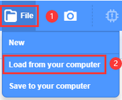	

   - Open a file of SB3, for example, .

     

     

------

##### Upload Code

- Load file at . 

- Set the development board and port. Click .

  

- Wait for uploading.

  

------

##### Set Baud Rate

- Set printing box size: 
  - small 
  - large 
  - none 

- Click  to set baud rate.


------

After that, you will see the serial monitor is printing “**Hello KidsBlock**”.


------
