# BBC Micro:bit

## 1. What is Micro:bit?

Micro:bit is an open source hardware platform based on the ARM architecture launched by British Broadcasting Corporation (BBC) together with ARM, Barclays, element14, Microsoft and other institutions. The core device is a 32-bit Arm Cortex-M4 with FPU micro-processing. 

Though it is just the size of a credit card, the Micro:bit main board is equipped with loads of components, including a 5*5 LED dot matrix, 2 programmable buttons, an accelerometer, a compass, a thermometer, a touch-sensitive logo and a MEMS microphone, a Bluetooth module of low energy, and a buzzer and others. Thus, it also boasts multiple functions. 

The buzzer built in the other side of the board plays all kinds of sounds without any external equipment. The golden fingers and gears provide a better fixing of crocodile clips. Moreover, this board has a sleeping mode to lower power consumption of batteries when users long-press the Reset & Power button on the back. It is capable of reading the data of sensors, controlling servos and RGB lights, and it is attaching with a shield so as to connect with various sensors. It also supports a variety of programming platforms and is compatible with almost all PCs and mobile devices. Also, driver is required. It is of high integration of electronic modules, and has a serial monitoring function for easy debugging.

The board has found wild applications. It can be applied in programming video games, making interactions between light and sound, controlling a robot, conducting scientific experiments, developing wearable devices. Basically, it always be utilized to make some cool inventions like robots and musical instruments.

------

### 1.1 Micro:bit V2 Mainboard Layout

------

### 1.2 Micro:bit V2 Pin-out

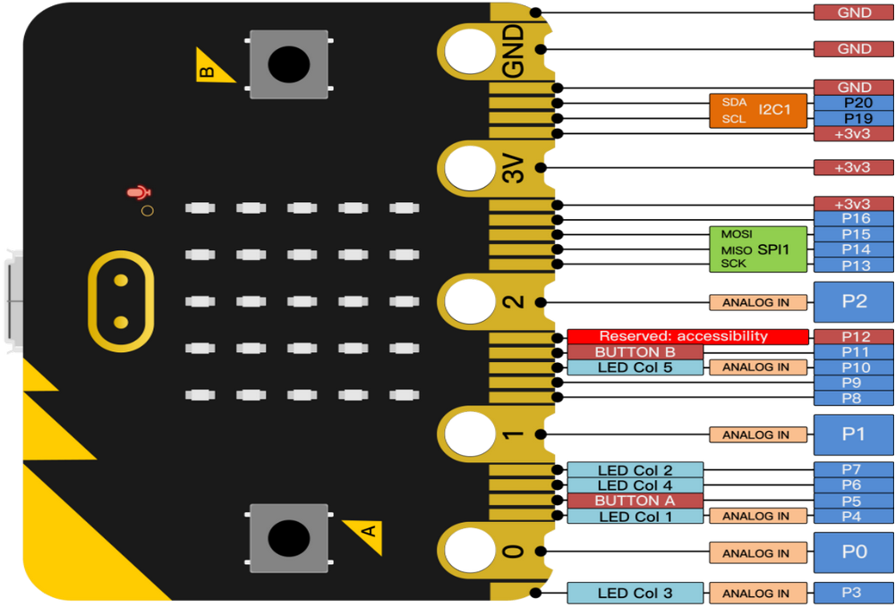

Micro:bit pin functions:

|       Function       | Pin                                                          |
| :------------------: | :----------------------------------------------------------- |
|         GPIO         | P0, P1, P2, P3, P4, P5, P6, P7, P8, P9, P10, P11, P12, P13, P14, P15, P16, P19, P20 |
|       ADC/DAC        | P0, P1, P2, P3, P4, P10                                      |
|         IIC          | P19(SCL), P20(SDA)                                           |
|         SPI          | P13(SCK), P14(MISO), P15(MOSI)                               |
|  PWM(commonly used)  | P0, P1, P2, P3, P4, P10                                      |
| PWM(uncommonly used) | P5, P6, P7, P8, P9, P11, P12, P13, P14, P15, P16, P19, P20   |
|       occupied       | P3(LED Col3), P4(LED Col1), P5(Button A), P6(LED Col4), P7(LED Col2), P10(LED Col5), P11(Button B) |

Visit the official website for more details:

[Microbit hardware](https://tech.microbit.org/hardware/edgeconnector/)

https://microbit.org/guide/hardware/pins/

------

### 1.3 Notes for the Application of Micro:bit

- It is recommended to cover it with a silicone protector to prevent short circuit for it has a lot of sophisticated electronic components.
- Its IO port is very weak in driving since it can merely handle current less than 300mA. Therefore, do not connect it with devices operating in large current, such as servo MG995 and DC motor or it will get burnt. Furthermore, you must figure out the current requirements of the devices before you use them and it is generally recommended to use the board together with a Micro:bit shield.
- It is recommended to power the main board via the USB interface or via the battery of 3V. The IO port of this board is 3V, so it does not support sensors of 5V. If you need to connect sensors of 5 V, a Micro: Bit expansion board is required.
- When using pins(P3, P4, P6, P7 and P10) shared with the LED dot matrix, blocking them from the matrix or the LEDs may display randomly and the data about sensors connected maybe wrong.
- Pin 19 and 20 can not be used as IO ports though the Makecode shows they can. They can only be used as I2C communication.
- The battery port of 3V cannot be connected with battery more than 3.3V or the main board will be damaged.
- Forbid to operate it on metal products to avoid short circuit.

To put it simple, Micro:bit V2 main board is like a microcomputer which has made programming at our fingertips and enhanced digital innovation. And as for programming environment, BBC provides a website: <https://microbit.org/code/>, which has a graphical MakeCode program easy for use.

------

## 2. Micro:bit Installation

**Micro:bit is free of driver installation. However, in case your computer fail to recognize the main board, you can install the diver too.**

**Driver installation: Please download tutorials in network disk.**

Connect micro:bit mainboard to computer via USB cable.

Click the driver file  and "Install".

------

------

Click Install.

------

Click “Install” and “Finish”.

------

------

Click “Computer”  —> “Properties” —> “Device manager”:

------

## 3 Programming

The following instructions are applied for Windows system but can also serve as a reference if you are using a different system.

### 3.1 Procedures

This chapter describes how to write program and load the program to the Micro: Bit mainboard. Visit official website for more details: <https://microbit.org/guide/quick/>

**3.1.1 Step 1: Connect to Micro:bit**

Connect the board to computer via USB cable. 

For how to program via mobile deceives: <https://microbit.org/get-started/user-guide/mobile/>

Multiple operation systems are compatible with this board, including Macs, PCs, Chromebooks and Linux (Raspberry Pi). 

------

If the red LED on the back of the board is on, that means the board is powered. When your computer communicates with the main board via the USB cable, the yellow LED on it will flashes. For example, it will flash when you burn a “hex” file.

Then Micro: bit main board will appear on your computer as a driver named “MICROBIT(E:)”. Please note that it is not an ordinary USB disk as shown below.

------

**3.1.2 Step 2: Write programs**

Online version of Makecode: <https://makecode.microbit.org/>

Click **New Project**;

The dialog box **Create a Project** appears, fill it with **heartbeat** and click **Create √** to edit.

If you are Windows 10 system, it is also viable to edit on the APP MakeCode for micro:bit , which is exactly like editing in the website. 

Windows 10 App download: [https://www.microsoft.com/](https://www.microsoft.com/zh-cn/p/makecode-for-micro-bit/9pjc7sv48lcx?ocid=badgep&rtc=1&activetab=pivot:overviewtab)

Here we demonstrate on Google Chrome.

------

Write a micro:bit code. 

You can drag some **Blocks** to the editing area and then run your program in Simulator as shown below: we demonstrate how to edit **heartbeat** program. 

------

Click “ JS JavaScript” to check JavaScript language.

------

Click the arrow to switch to “Python” language.

------

**3.1.3 Step 3: Download code**

If your computer is Windows 10 and you have downloaded the APP MakeCode, what you will only have to do is to download the program to your Micro: Bit board.

If you are writing program through the website, following these steps:

1. Click the ‘Download’ in the editor to download a "hex" file, which is a compact program format for Micro: Bit to read;
2. Copy the "hex" file to your board. For Windows, you can also click and select ‘Send to → MICROBIT(E:) ‘to copy the hex file to the Micro: Bit board. 

------

Or, you may directly drag the “hex” file in **MICROBIT**.

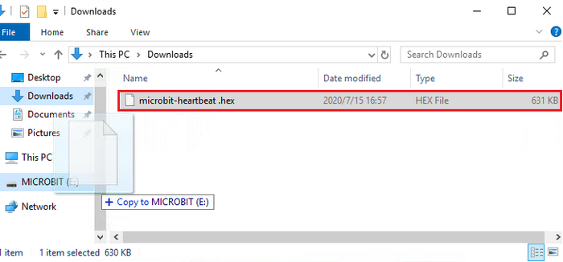

During the process of copying the hex file to the Micro: bit, the yellow LED on the back of the board flashes. When the duplication is completed, the LED will stop flashing and remain on.

**3.1.4 Step 4: Run program**

After the program is uploaded to the Micro: bit, you can power it via USB cable or an external power. Then the 5 x 5 LED dot matrix displays a heartbeat pattern.

**Power via USB**

------

**Power via external 3V**

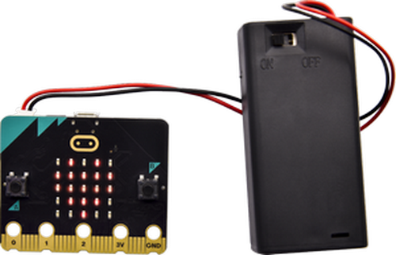

**Caution:**

- When you programs each time, the driver of Micro: bit will automatically eject and return so the hex files will disappear. 
- The board only has access to hex files rather than save them.

------

**3.1.5 Step 5: Other programming languages**

This chapter has described how to use the Micro:bit main board.

Except for the Makecode graphical programming, if you want to write Micro:bit programs in other languages.

### 3.2 Makecode

Google Chrome online version: <https://makecode.microbit.org/>

Or open the Windows 10 App makecode.

------

Click “New Project” and enter “heartbeat” to edit the code. Here is the main interface of Makecode.

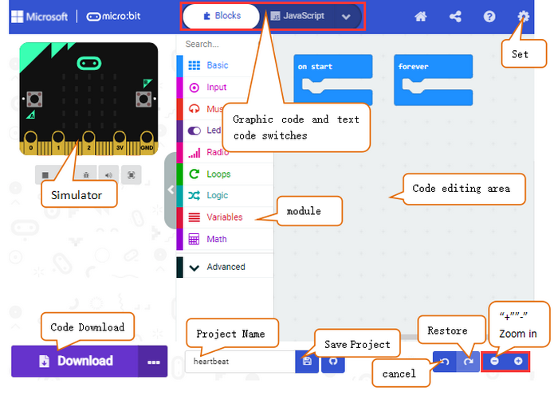

There are blocks “on start” and “forever” in the code editing area. 

When the power is plugged or reset, “on start” means that the code in the block only executes once, while “forever” implies that the code runs cyclically.

------

### 3.3 Quick Download

As mentioned before, if your computer is Windows 10 and you have downloaded the APP MakeCode. you can quickly download codes to the Micro: Bit main board  by selecting ‘Download’.

While it is a little more trickier if you are using a browser to enter Makecode. However, if you adopt Google Chrome that is suitable for Android, ChromeOS, Linux, macOS and Windows 10, the process can be easier, too.

We use the webUSB of Chrome to access the hardware device connected by USB.

You could refer to the following steps to connect and pair devices.

**Devices Pairing**

Connect the board to computer via USB cable. 

------

Click “...” and “Connect device”.

------

“Next”.

------

“Next”.

------

Then select the corresponding device and click “Connect”. If no device shows up for selection, please refer to: <https://makecode.microbit.org/device/usb/webusb/troubleshoot>

If the links are too troublesome, we also provide **Troubleshooting** in tutorial. 

For how to update micro:bit firmware: <https://microbit.org/guide/firmware/>

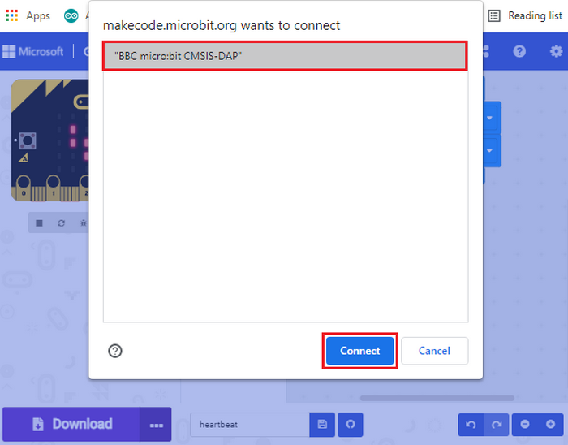

------

Click “Done”.

------

**Download program**

After connection, click  and it will change into .

------

### 3.4 Makecode Extension Library

**3.4.1 Add library**

Please follow the steps to add extension files:

Open makecode to enter a certain project, click the gear-shaped icon(settings) in the upper right corner to choose “Extensions”.

------

Or click Advanced to add Extensions.

------

Search the library you want. 

------

For instance, a servo library is required, so you can search "servo" to add one.

------

Back to the interface and you can see a **Servos** library.

------

**3.4.2 Update/Delete library**

Click **Js JavaScript** to switch to text code.

------

Click Explorer.  

------

Find the library you want to remove and click to delete it.

------

Click **Remove it**.

------

Click **Blocks** to return to graphical programming. 

------

------

### 3.5 Resources and Test Code

[Click to download the tutorials and code files](MakeCode/code.zip).

**3.5.1 Import code**

We provide hexadecimal code files (project files) for each project. The file contains all the contents of the project and can be imported directly, or you can manually build the code blocks. 

**For simple projects, dragging a block of code to complete the program is recommended.**

**For complex ones, it is recommended to conduct the program by loading the hex code files.**

Let's take the "Heart beat" project as an example to show how to load the code. Open the Web version of Makecode or the Windows 10 App Makecode, and click “Import”.

------

Click “Import File...”.

------

Choose “Heart beat.hex”.

------

In addition to the above method, you can also drag the the test code into the code editing area, as shown below:

------

Wait for loading.

------

**3.5.2 Install CoolTerm**

If your computer is Win7/8, the pairing cannot be done via Google Chrome. Therefore, digital signal or analog signal of sensors and modules cannot be shown on the serial simulator. So what can we do? CoolTerm software is a nice choice to read the serial data.

CoolTerm download: <https://freeware.the-meiers.org/>

1. We take PC Windows as an example to download and unzip CoolTerm Win, and Mac/Linux can take it as a reference. 
    
    
2. Make sure the driver is connect to computer, and click to execute the software.

    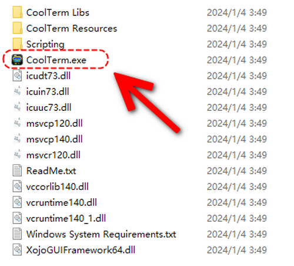

3. The functions of each button on the Toolbar are listed below: 

    

|        Icon         |                     Function                     |
| :-----------------: | :----------------------------------------------: |
|  |             Opens up a new Terminal              |
|  |             Opens a saved Connection             |
|  |       Saves the current Connection to disk       |
|  |           Opens the Serial Connection            |
|  |           Closes the Serial Connection           |
|  |             Clears the Received Data             |
|  |       Opens the Connection Options Dialog        |
|  | Displays the Terminal Data in Hexadecimal Format |
|  |             Displays the Help Window             |

  

------

## 4. Micro:bit Basic Projects

### Project 1: Heartbeat

**1. Introduction**

This project is easy to conduct with a micro:bit main board, a Micro USB cable and a computer. The micro:bit LED dot matrix will display a beating heart. It serves as a start for your entry to the programming world!

**2. Components**

| Micro:bit mainboard*1 |  |
| --------------------- | ------------------ |
| Micro USB cable*1     |  |

**3. Connection**

Connect the board to your computer via micro USB cable.

**4. Test Code**

Please check code in Project 1 file.

Visit <https://makecode.microbit.org/reference> to find more information about micro: bit blocks. 

Visit <https://makecode.microbit.org/> for programming helps.

**Find code blocks:**

**Build blocks:**

Click “JSJavaScript” to see Java code:

Pull down to click “Python” to see Python code:

------

**5. Test Result**

After uploading test code to micro:bit main board and keeping the connection with the computer to power the main board, the LED dot matrix shows pattern “❤” and “”,  alternately.

**If the downloading is not smooth, please remove the USB cable from the main board and then reconnect them and reopen Makecode to try again.**

------------

### Project 2: Single LED Blinking

**1. Introduction**

In this project, we intend to control a certain LED of the micro:bit main board to light up.

**2. Components**

| Micro:bit mainboard*1 |  |
| --------------------- | ------------------ |
| Micro USB cable*1     |  |

**3. Connection**

Connect the board to your computer via micro USB cable.

**4. Knowledge**

The LED dot matrix consists of 25 LEDs arranged in a 5 by 5 square. 

In order to locate these LEDs quickly, as the figure shown below, we can regarded this matrix as a coordinate system by marking 0~4 from top to bottom and from left to right. Therefore, the LED sat in the second of the first line is (1,0) and the LED positioned in the fifth of the fourth column is (3,4), and others likewise.

**5. Test Code**

**Find code blocks:**

**Build blocks:**

**6. Test Result**

After uploading test code to micro:bit main board and powering the main board via the USB cable, the LED in (1,0) lights up for 1s and the one in (3,4) shines for 1s and this sequence will repeat.

-------------------

### Project 3: LED Dot Matrix

**1. Introduction**

Dot matrices are very commonplace in daily life. They have found wide applications in LED advertisement screens, elevator floor display, bus stop announcement and so on.

The LED dot matrix of Micro: Bit main board contains 25 LEDs in a grid. Previously, we have succeeded in controlling a certain LED to light by integrating its position value into the test code. Theoretically, we can turn on many LEDs at the same time to show patterns, digits and characters. 

What’s more, we can also click ”show icon“ to choose the pattern we like to display. Last but not the least, we can design patterns by ourselves as well.

**2. Components**

| Micro:bit mainboard*1 |  |
| --------------------- | ------------------ |
| Micro USB cable*1     |  |

**3. Connection**

Connect the board to your computer via micro USB cable.

**4. Test Code**

**Find code blocks:**

**Build blocks:**

**5. Test Result**

After uploading test code to micro:bit main board and powering the main board via the USB cable, we find that the 5*5 dot matrix start to show numbers 1, 2, 3, 4 and 5, and then it alternatively shows , “Hello!”, , , ,  and !

--------------------

### Project 4: Programmable Buttons

**1. Introduction**

Buttons can be used to control circuits. In an integrated circuit with a button, the circuit is connected when the button is pressed and if you release the button, the circuit is open.

Micro: Bit main board boasts three buttons: two programmable buttons (marked with A and B), and a reset button at back. By pressing the two programmable buttons, three different signals can be input. We can press button A or B or both so that the LED dot matrix shows A, B and AB respectively. 

Let’s get started!

**2. Components**

| Micro:bit mainboard*1 |  |
| --------------------- | ------------------ |
| Micro USB cable*1     |  |

**3. Connection**

Connect the board to your computer via micro USB cable.

**4. Test Code 1**

**Find code blocks:**

**Build blocks:**

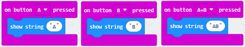

**5. Test Result 1**

After uploading test code and powering on, the 5*5 LED dot matrix shows A if button A is pressed and then released, B if button B pressed and released, and AB if button A and B pressed together and then released.

****6. Test Code 2****

**Find code blocks:**

------

------

------

------

**Build blocks:**

------

****7. Test Result 2****

After uploading test code and powering on, when the button A is pressed, the LEDs in red increase; when the button B is pressed, the LEDs in red reduce.

-------------------

### Project 5: Temperature Detection

**1. Introduction**

The Micro:bit main board is actually not equipped with a temperature sensor, but uses nNFR52833 chip for temperature detection. Therefore, the detected value is much closer to the temperature of the processor, so there maybe deviation from the ambient value. 

Its detection range is -40 ~ 105℃.

**2. Components**

| Micro:bit mainboard*1 |  |
| --------------------- | ------------------ |
| Micro USB cable*1     |  |

**3. Connection**

Connect the board to your computer via micro USB cable.

**4. Test Code 1**

**Find code blocks:**

------

------

------

**Build blocks:**

**5. Test Result 1**

After uploading test code 1 to micro:bit main board, powering the main board via the USB cable, and click “**Show console Device**”, the temperature value shows in the serial monitor as shown below.

When you touch the processor nNRF52833 on the board for a while, its temperature will rise gradually and the CoolTerm serial monitor will show this change:

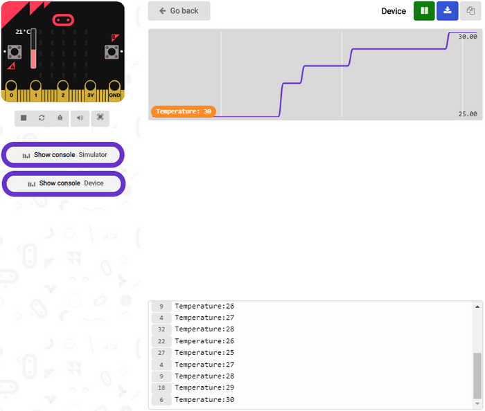

If you're running Windows 7 or 8 instead of Windows 10, Google Chrome won't be able to match devices. so you'll need CoolTerm.

Open CoolTerm and click **Options** to select **SerialPort**, set COM port and put baud rate to 115200 (after testing, the baud rate of USB SerialPort communication on Micro: Bit main board is 115200), and then click **OK** and **Connect**. 

------

The CoolTerm serial monitor shows the change of temperature in the current environment, as shown below:

****6. Test Code 2****

**Find code blocks:**

------

------

------

------

**Build blocks:** 35 in the code can be modified according to actual conditions.

****7. Test Result 2****

After uploading the code 2 to the board, when the ambient temperature is less than 35℃, the 5*5 LED dot matrix shows . You may cover the sensor on the board to make the temperature equal to or become greater than 35℃, and then 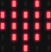 will appear.

-----------

### Project 6:  Geomagnetic Sensor

**1. Introduction**

This project aims to explain the use of the Micro: bit geomagnetic sensor, which can not only detect the strength of the geomagnetic field, but also be used as a compass to find bearings. It is also an important part of the Attitude and Heading Reference System (AHRS). 

Micro: Bit main board uses LSM303AGR geomagnetic sensor, which supports four modes namely 100 kHz, 400 kHz, 1 MHz and 3.4 MHz and the dynamic range of magnetic field is ±50 gauss. In the board, the magnetometer module is used in both magnetic detection and compass. 

In this experiment, the compass will be introduced first, and then the original data of the magnetometer will be checked. The main component of a common compass is a magnetic needle, which can be rotated by the geomagnetic field and point toward the geomagnetic North Pole (which is near the geographic South Pole) to determine direction.

**Attention: this geomagnetic sensor built in the board can help us determine bearings by showing readings in the value from 0 to 360. And we need to calibrate it for the first by rotating. Please note that metal materials around may attenuate the accuracy of the reading and calibration.**

**2. Components**

| Micro:bit mainboard*1 |  |
| --------------------- | ------------------ |
| Micro USB cable*1     |  |

**3. Connection**

Connect the board to your computer via micro USB cable.

**4. Test Code 1**

**Find code blocks:**

------

------

------

**Build blocks:**

------

Note: it is imperative to calibrate the Micro:bit board because different geomagnetic fields exist in different places. And the board requires a calibration for the first using time.

**5. Test Result 1**

After uploading code and powering on, press the button A and the board need to be calibrate when you see LED dot matrix shows “TILT TO FILL SCREEN”. Rotate the board until all 25 red LEDs are on as shown below.

After completing calibration, a smile  will appear. Press button A, and the detected magnetometer value will show. And the direction north, east, south and west correspond to 0°, 90°, 180° and 270° respectively.

**6. Test Code 2**

We read the value to determine direction: the arrow points to the current magnetic North Pole.

For the above picture, the arrow pointing to the upper right when the value ranges from 292.5 to 337.5. 

0.5 can’t be input in the code, so the values we get are 293 and 338. We add other statements to make a set of complete code.

**Find code blocks:**

------

------

------

------

------

 **Build blocks:**

 

 

 

**7. Test Result 2**

After uploading code and calibrating, tilt micro:bit board and the LED dot matrix displays the direction signs. 

----------------

 ### Project 7: Accelerometer

**1. Introduction**

The micro:bit board boasts a built-in LSM303AGR acceleration sensor (accelerometer) which includes standard, fast, plus and high-speed mode (100 kHz, 400 kHz, 1 MHz and 3.4 MHz) of I2C serial bus interface and SPI serial standard interface for external communication, with resolution of 8/10/12 bits and range of ±2g, ±4g, or ±8g.

When the micro:bit board is at rest or in uniform motion, the accelerometer only detects the acceleration of gravity. If the board is slightly swung, the detected acceleration is much less than the that of gravity, but the difference can be ignored. Therefore, we mainly detect the change of gravitational acceleration on the x, y, and z axes.

In this project, we will introduce how to measure the position of the board with the accelerometer. And then we may have a look at the original three-axis value output by the accelerometer.

**2. Components**

| Micro:bit mainboard*1 |  |
| --------------------- | ------------------ |
| Micro USB cable*1     |  |

**3. Connection**

Connect the board to your computer via micro USB cable.

**4. Test Code 1**

**Find code blocks:**

------

------

------

**Build blocks:**

------

**5. Test Result 1**

After uploading code and powering on, if we shake the Micro:Bit board(any direction), the LED dot matrix displays the digit “1”.

When the logo is kept above, number 2 displays.

------

When it is kept upside down(logo below the LED dot matrix), it shows as below.

------

When it is placed on the desk, the number 4 appears.

------

When it is covered on the desk, the number 5 exhibits.

When the board is tilted to the left, the LED dot matrix shows the number 6 as shown below.

------

When the board is tilted to the right , the LED dot matrix displays the number 7 as shown below:

------

When the board falls down to the floor (a free fall), the LED dot matrix shows the number 8. (Please note that this test is not recommended for it may damage the main board.)

If you’d like to try this function, you can also set the acceleration to 3g, 6g or 8g. But still ,we do not recommend.

**6. Test Code 2**

**Find code blocks:**

------

------

------

**Build blocks:**

**7. Test Result 2**

Upload test code to micro:bit main board, power the main board via the USB cable, and click “Show console Device”.

After referring to the MMA8653FC data manual and the hardware schematic diagram, the accelerometer coordinate of the Micro: Bit are shown in the figure below:

The following interface shows the decomposition value of acceleration in X axis, Y axis and Z axis respectively, as well as acceleration synthesis (acceleration synthesis of gravity and other external forces).

If you're running Windows 7 or 8 instead of Windows 10, via Google Chrome won't be able to match devices. You'll need to use the CoolTerm serial monitor to read value.

Open CoolTerm and click **Options** to select **SerialPort**, and set COM port and baud rate to 115200. Click **OK** and **Connect**. The CoolTerm serial monitor shows the data of X axis, Y axis and Z axis , as shown in the figures below:

### Project 8: Light Brightness Detection

**1. Introduction**

In this experiment, we will use the micro:bit board to detect light intensity. Since the micro:bit board does not contains its own photoresistor, the LED dot matrix will shoulder this job. The light signal will convert into input, and the voltage decay time is sampled so that the detected light intensity is a relative value. 

**2. Components**

| Micro:bit mainboard*1 |  |
| --------------------- | ------------------ |
| Micro USB cable*1     |  |

**3. Connection**

Connect the board to your computer via micro USB cable.

**4. Test Code**

**Find code blocks:**

------

------

------

------

**Build blocks:**

**5. Test Result**

Upload the test code to micro:bit main board, power the board via the USB cable and click “Show console Device”. 

When the LED dot matrix is covered by hand, the light intensity is approximately 0; when the LED dot matrix is exposed to light, the light intensity gets stronger with the light as shown below:

20 in the code is an arbitrary value of light intensity. If the current light value is less than or equal to 20, the icon moon will appear on the LED dot matrix. If it's bigger than 20, the sun will appear.

If you're running Windows 7 or 8 instead of Windows 10, Google Chrome won't be able to match devices. CoolTerm will be required.

Open CoolTerm and click **Options** to select **SerialPort**, and set COM port and baud rate to 115200, click **OK** and **Connect**. The CoolTerm serial monitor shows the value of light intensity, as shown below:

------------------

### Project 9: Speaker

**1. Introduction**

Micro: Bit board boasts an built-in speaker, which makes sound to the programs easier. It is also able to make sound such as utter giggles, greetings and yawning as well as all kinds of tones, like playing the song *Ode to Joy*.

You can also turn off the built-in speaker to enjoy the beautiful music via headphones connected to GND and P0. In MakeCode, you need to turn off the speaker by "Turn off built-in speakers" block.

**2. Components**

| Micro:bit mainboard*1 |  |
| --------------------- | ------------------ |
| Micro USB cable*1     |  |

**3. Connection**

Connect the board to your computer via micro USB cable.

**4. Test Code 1**

**Find code blocks:**

------

------

------

**Build blocks:**

**5. Test Result 1**

After uploading code and powering on, the speaker utters sound and the LED dot matrix shows the logo of music.

**6. Test Code 2**

**Find code blocks:**

------

------

------

**Build blocks:**

*Ode to Joy*:

For more information about musical notations: <https://en.wikipedia.org/wiki/Numbered_musical_notation>

-----------------

### Project 10: Touch-sensitive Logo

**1. Introduction**

The Micro: Bit main board is equipped with a golden touch-sensitive logo, which can act as an extra button. This capacitive touch sensor senses small changes in the electric field when it is pressed or touched.

**2. Components**

| Micro:bit mainboard*1 |  |
| --------------------- | ------------------ |
| Micro USB cable*1     |  |

**3. Connection**

Connect the board to your computer via micro USB cable.

**4. Test Code**

**Find code blocks:**

------

------

------

------

------

------

**Build blocks:**

**5. Test Result**

After uploading the code and powering on, the LED dot matrix exhibits the heart pattern “❤” when the logo is pressed or touched, and it displays digit when the logo is released. The longer it is pressed, the bigger the number is when it is released.

---------------------

### Project 11: Microphone

**1. Introduction**

The Micro:bit mainboard is built with a microphone which can test the volume of ambient environment. When you clap, the microphone LED indicator turns on. So, you can make a disco lighting changing with music. The microphone is placed on the opposite side, and an LED indicator is next to the hole that lets sound pass. When the board detects sound, the LED indicator lights up.

**2. Components**

| Micro:bit mainboard*1 |  |
| --------------------- | ------------------ |
| Micro USB cable*1     |  |

**3. Connection**

Connect the board to your computer via micro USB cable.

**4. Test Code 1**

**Find code blocks:**

------

------

**Build blocks:**

**5. Test Result 1**

After uploading test code to micro:bit main board and powering the board via the USB cable, the LED dot matrix displays “❤” when you clap, and “” appears when it is quiet around.

**6. Test Code 2**

**Find code blocks:**

------

------

------

------

------

**Build blocks:**

**7. Test Result 2**

Upload test code and power on and click “Show console Device” as shown below: 

The louder the sound is, the greater the sound value will show on the serial monitor:

When the button A is pressed, the LED dot matrix displays the value of the biggest volume. Please note that the biggest volume can be reset via the Reset button. When you clap, the LED dot matrix shows the pattern of the sound.

----------------

### Project 12: Play Music

**1. Introduction**

In the previous projects, we have learned about the touch-sensitive logo and the speaker respectively.

In the project, we will combine these two components to play music. We will apply the Logo to control the speaker to sing songs.

**2. Components**

| Micro:bit mainboard*1 |  |
| --------------------- | ------------------ |
| Micro USB cable*1     |  |

**3. Connection**

Connect the board to your computer via micro USB cable.

**4. Test Code**

**Find code blocks:**

------

------

------

------

------

**Build blocks:**

**5. Test Result**

After uploading test code to micro:bit main board and powering the board via the USB cable, the speaker plays *Birthday Song* when the logo is touched.

--------------------

### Project 13: Dodge Bullets

**1. Introduction**

We have learned about the two programmable buttons: button A and B. In this project, we will combine them with LED dot matrix to design a game: Dodge Bullets.

**2. Components**

| Micro:bit mainboard*1 |  |
| --------------------- | ------------------ |
| Micro USB cable*1     |  |

**3. Connection**

Connect the board to your computer via micro USB cable.

**4. Test Code 1**

**Find code blocks:**

------

------

------

------

------

------

------

------

**Build blocks:**

------

**6. Test Result 1**

The game begins when the code is uploaded to the main board. The bullets fall off and we need to control the role G by Button A and B to shun them. If the role fail to avert the attacks, game is over.

**7. Test Code 2**

Dodge bullets! Earn points!

Get one point for dodging one bullet; Game over when the role G is hit by bullet and the points will be output. Press A and B together, restart the game.

**Find code blocks:**

------

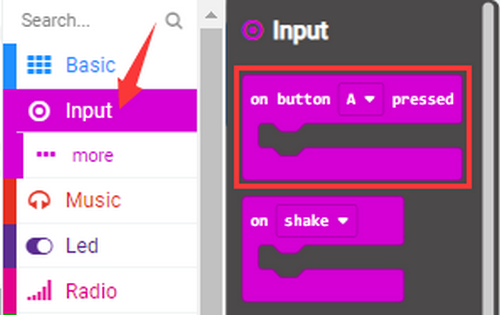

------

------

------

------

------

------

------

------

------

**Build blocks:**

------

------

------

**8.  Test Result 2**

The game begins when the code is uploaded to the main board. The bullets fall off and we control the role G by Button A and B to shun them. 1 score will be tallied for each successful dodging. If the role fail to avert the attacks, the game is over and gained scores displays.

Press buttons A and B at the same time, and the game starts again.

---------------------

### Project 14: Bluetooth Wireless Communication

**1. Introduction**

The Micro:bit main board comes with a nRF52833 processor with a built-in BLE(Bluetooth Low Energy) Bluetooth 5.1 device and a 2.4GHz antenna for Bluetooth wireless communication, so that the board is able to communicate with a variety of Bluetooth devices, including smart phones and tablets.

In this project, we mainly concentrate on the Bluetooth wireless communication to transmit code or signals. Firstly, we should connect a device (a phone or an iPad) to the board. 

Since setting up Android phones to achieve wireless transmission is similar to that of Apple devices, no need to illustrate again.

**2. Components**

| Micro:bit mainboard*1 |    |
| --------------------- | -------------------- |
| Micro USB cable*1     |    |
| smart phone/IPad*1    |  |

**3. Connection**

Connect the board to your computer via micro USB cable.

**4. Procedures**

We will demonstrate on iPhone/iPad/MAC devices. Android/Windows devices may take these as a reference.

**(1) Firmware (iOS/MAC only)**

iOS/MAC: <https://www.microbit.org/get-started/user-guide/ble-ios/>

Click “Download pairing HEX file” to download the Micro: Bit firmware and upload the downloaded firmware to the Micro: Bit main board.

------

------

**(2) Micro:bit APP**

Open App Store and search “micro bit” and click “” to download the APP.

**(3) Connection**

Connect your Apple device with Micro: Bit main board.

- Turn on Bluetooth on the device.
- Open  APP, ensure the board is connected to the device and select “Choose micro:bit”to start pairing Bluetooth.

  - Pair a new micro:bit.

    

  - Following the instructions to press button A and B at the same time(do not release them until you are told to) and press Reset & Power button for a few seconds. 

- Release the Reset & Power button, you will see a password pattern shows on the LED dot matrix. Now , release buttons A and B and click “Next”.

  - Set the password pattern on your Apple device as the same pattern showed on the matrix and click “Next”.  

  - Still click “Next”and a dialog box props up as shown below. Then click "Pair". A few seconds later, the match is done and the LED dot matrix displays the "√" pattern.

    

    

    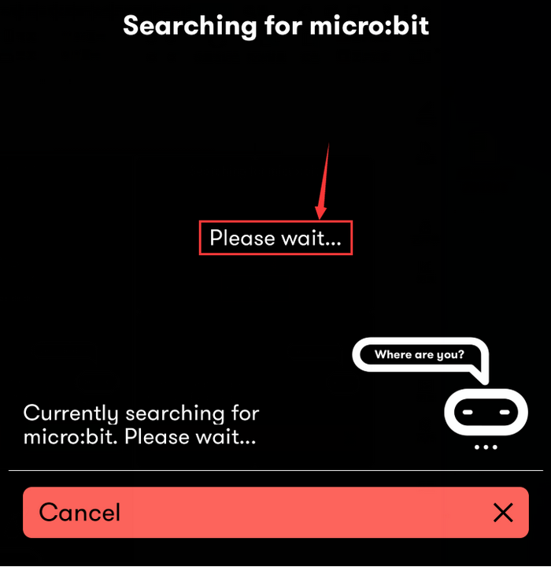

    

  - After the match with Bluetooth, write and upload code with the App.

**(4) Create Code**

Click “Create Code” to enter the programming page and write code. Click "New Project" and you will see , and then select “Create √”. 

Name the project as “1 “and click “” to save the code.

Click “Flash” to enter the uploading page. 

The default code program for uploading is the one saved just now and named "1" and then click "Flash" to upload the code program "1".

If the program “1” is uploaded successfully a few seconds later, the App will show as below and the LED dot matrix will display a heart pattern.

------

