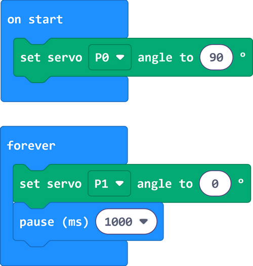
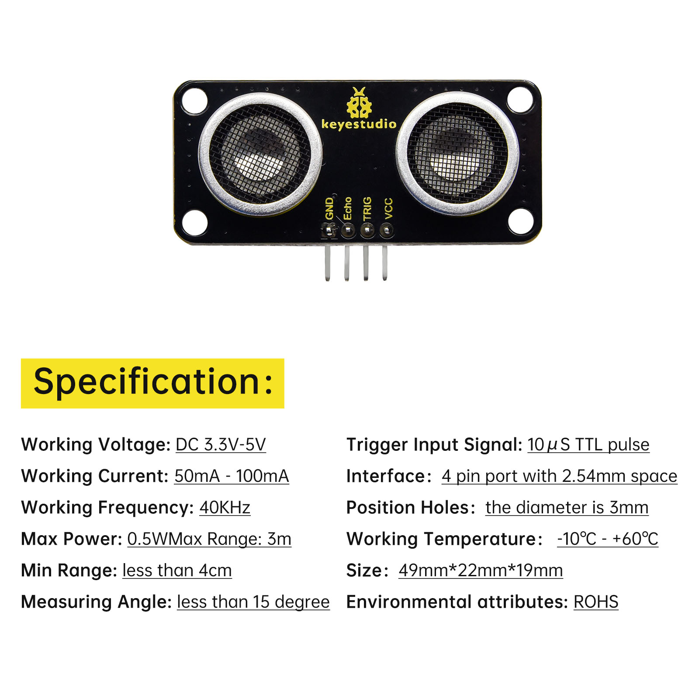

# Micro:bit Greeting Robot Projects

## 1. Projects

[Click to download codes](MakeCode/code.zip).

### 1.1 Servo

A servo is a kind of position driver, which is mainly composed of housing, circuit board, core-less motor, gear and position detector. The receiver or microcontroller sends a signal to the servo which has an internal reference circuit that generates a reference signal with a period of 20ms and a width of 1.5ms, and compares the DC bias voltage with the voltage of the potentiometer to output voltage difference.

There are many specifications of servos, yet all contains three colors of wires: brown, red and orange. Brown is the grounded, red is the positive, and orange is signal. The wire colors may vary from brands.

The rotation Angle of the servo is controlled by adjusting the duty cycle of the PWM (pulse width modulation) signals. Theoretically, the period of the standard PWM signal is fixed at 20ms (50Hz), so the pulse width should be 1ms ~ 2ms. But in fact, it is 0.5ms ~ 2.5ms, corresponding to the servo angle of  0° ~ 180°.

**1.1.1 Parameters**

Operating voltage: DC 3.3 ~ 5V

Operating Angle range: approx. 180°(at 500→2500 μsec)

Pulse width: 500→2500 μsec

No load speed: 0.12± 0.01sec /60 (DC 4.8V)        0.1± 0.01sec /60 (DC 6V)

No load current: 200±20mA (DC 4.8V)         220±20mA (DC 6V)

Stopping torque: 1.3±0.01kg·cm (DC 4.8V)          1.5±0.1kg·cm (DC 6V)

Stop current: ≦850mA (DC 4.8V)           ≦1000mA (DC 6V)

Standby current: 3±1mA (DC 4.8V)           4±1mA (DC 6V)

**1.1.2 Wiring Diagram**

| Expansion board |  Servo A   |
| :-------------: | :--------: |
|       GND       | G (brown)  |
|       3V3       |  V (red)   |
|    P1 / io14    | S (yellow) |

------

**1.1.3 Test Code**

ATTENTION: The servo is able to rotate from 0 to 180 degrees. Yet after assembly, it can only move within 0-90 degrees. Otherwise, it may burn out due to stuck and overheating.

[**Click to download codes**](./MakeCode/code.zip).

**Build code blocks manually:**

1\. Click  to load the library of servo.

2\. Search “Servo” and you will see the **Servo** library. Click to load it.

3\. Successfully loaded.

4\. In , put  into , and set pin to P0, angle to 0 degree.

5\. In , put  under , and set the delay to 1000ms.

6\. Repeat step 4 and 5, but set the angle to 60 degree and 90 degree.

**Complete code:**

**1.1.4 Test Result**

The arm of the greeting robot moves.

------

### 1.2 Waving Arm

We combine two servos to make the robot to do some actions.

**1.2.1 Test Code: Left-turn** 

1\. In , put  into , and set the pin to P0, angle to 0 degree.

2\. In , put  and  into , and set the pin to P1, angle to 0 degree.

3\. Repeatedly, but set P1 to 90°.

**1.2.2 Result**

The palm of the greeting robot turns left.

**1.2.3 Test Code: Greeting**

1\. In , put  into , and set the pin to P0, angle to 90.

2\. In , put  and  into , and set the pin to P1, angle to 0 degree.

3\. Repeatedly, but set P1 to 90°.

**1.2.4 Result**

The robot put its arms up and wave for welcome.

------

### 1.3 Ultrasonic

Before learning: In this project, we introduce the fundamentals of ultrasound. We will use the ultrasonic sensor to print detected distances on the serial monitor.

**1.3.1 Overview**

Like bats, HC-SR04 ultrasonic sensor uses sonar to determine the distance to an object. It provides excellent contact-less range inspection with high accuracy and stable readings. It is also equipped with ultrasonic transmitter and receiver. It is widely applied to electronics projects for obstacle detection and distance measurement.

**1.3.2 Module Parameters**

**1.3.3 Wiring Diagram**

| Expansion board | Ultrasonic sensor |
| :-------------: | :---------------: |
|       3V3       |        VCC        |
|      TRIG       |     P12/io15      |
|      ECHO       |      P8/io4       |
|       GND       |        GND        |

**1.3.4 Test Code**

Add an Extension.

Search sonar and click to load it.

Make a variable.

Set a serial port.

Initialize the serial port.

Initialize the ultrasonic sensor, and assign the ultrasonic sensor value to the variable.

Print the ultrasonic sensor value on the serial monitor.

**Complete code:**

**1.3.5 Test Result**

Open the serial monitor and set the baud rate.

Put an object in front of the ultrasonic sensor, and it will detect the corresponding distance value. 

NOTE: The sensor is not professional and just used for learning.

------

### 1.4 Greeting Robot

Before learning: We combine the servos and ultrasonic sensor in this project. When the sensor detects any thing within the distance of 15~35CM, the greeting robot waves its arm as a welcome.

**1.4.1 Test Code**

1\. In , make a variable to store the detected distance value.

2\. Assign the detected distance value to the variable.

3\. Set P0 and P1 servo to 0°.

4\. In , put  into “forever”.

And put  and  into  in sequence.

When the ultrasonic sensor detects object(s) with the distance of 15~35CM;

P1 servo rotates within 0~90° to wave the arm.

Or else, the robot stops waving arm and put his arm to the original position. 

**Complete code:**

**1.4.2 Test Result**

When someone approaches, the robot begins to greet him/her.

------

## 2. Troubleshooting

### 2.1 Code fails to download to Micro:bit

**Problem**

Recently, many users encounter the issue that Micro:bit board doesn’t respond when download code.

If the way you operate is correct, maybe you accidentally press the reset button and enter the Maintenance mode or the firmware is lost due to mis-operation.

Plug in Micro:bit board, the “MAINTENANCE” drive appears, which means the program can’t be downloaded.

**Solution**

1. Download the **hex file** from this page to your computer.

	Down load the latest micro:bit firmware-0255: https://www.microbit.org/get-started/user-guide/firmware/ 
	If you do not want to download from this website, we also provide it in our tutorial.

2. After the latest firmware is downloaded, then drag it into the “MAINTENANCE” to make Micro:bit back to normal mode.

**Avoid to Enter “MAINTENANCE”**

1. Make sure the Reset button is **not** pressed when plugging the board by USB cable.

      
      
2. Don't unplug the cable suddenly during downloading micro:bit program, otherwise, the firmware will be lost and micro:bit will enter “MAINTENANCE” mode.
3. In the experiment, wrong wiring also cause a short circuit or firmware lost.

------

### 2.2 Troubleshooting-Download with WebUSB

Having trouble pairing the Micro: bit with WebUSB (/ device/usb/webusb)?

**Step 1: Check cable**

Make sure that your micro:bit is connected to your computer with a micro USB cable. You should see a **MICROBIT** drive appear in Windows Explorer when it’s connected.

**If you can see the MICROBIT, please go to step 2**.

If you can’t:

- Make sure that the USB cable is working. Does the cable works on another computer? If not, find a different cable to use. Some cables may only provide a power connection and don’t actually transfer data.
- Try another USB port on your computer. 
- Is the cable good but you still can’t see the **MICROBIT** drive? Hmm, you might have a problem with your micro:bit. 
- Try the additional steps described in the [fault finding](https://support.microbit.org/support/solutions/articles/19000024000-fault-finding-with-a-micro-bit) at microbit.org.
- If this doesn’t help, you can create a [support ticket](https://support.microbit.org/support/tickets/new) to notify the Micro:bit Foundation of the problem. If you do so, **skip the rest of these steps**.

------

**Step 2: Check firmware version**

It’s possible that the firmware version on the micro:bit needs an update. Let’s check:

1. Go to the **MICROBIT** drive.

2. Open the **DETAILS.TXT** file.

3. Look for the version number. It should say **Version: ...**

	

	Or **Interface Version: ...**  

If the version is **0234**, **0241**, **0243**, you need to update the firmware on your micro:bit. Go to **Step 3** and follow the upgrade instructions.

If the version is **0249**, **0250** or higher, you have the right firmware, just go to **step 4**.

------

**Step 3: Update firmware**

1. Put your micro:bit into **MAINTENANCE Mode**. 

	To do this, please unplug the USB cable from the micro:bit and then re-connect the USB cable after pressing and holding the reset button. Once you insert the cable, you can release the reset button. You should now see **MAINTENANCE** instead of the **MICROBIT** drive. Also, a yellow LED indicator will stay on. 

2. Download firmware .hex file: <https://microbit.org/guide/firmware/>
3. Drag the file into the **MAINTENANCE** drive.
4. The yellow LED will flash while the HEX file is copying. After that, the LED will go off and the micro:bit resets. The **MAINTENANCE** drive now changes to **MICROBIT**.
5. The upgrade is complete! You can open the **DETAILS.TXT** file to check the firmware version that matches the one of the **HEX** file you copied.

If you want to know more about connecting the board, MAINTENANCE Mode, and upgrading the firmware, please refer to [Firmware guide](https://microbit.org/guide/firmware/).

------

**Step 4: Check version of Browser**

WebUSB may require you to update your browser. 

Check that your browser version matches one of these: **Android**, **Chrome OS**, **Linux**, **macOS** and **Windows 10 Chrome 65+**.

------

**Step 5: Pair device**

Once you’ve updated the firmware, open the **Chrome Browser**, go to the editor and click on **Pair Device** in settings. 

See [WebUSB (/ device / usb / webusb) for pairing instructions](https://microbit.org/get-started/user-guide/web-usb/). 

------

## 3. Resources

Keyestudio official:

[https://www.keyestudio.com/](https://www.keyestudio.com/)

Keyestudio wiki main page:

[https://wiki.keyestudio.com/Main_Page](https://www.keyestudio.com/)

MicrobitCode:

<https://makecode.microbit.org/>

Microbit official:

<https://www.microbit.org/>