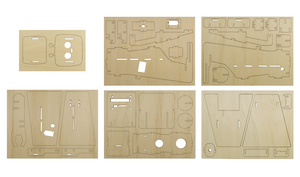
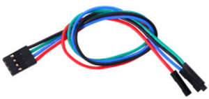
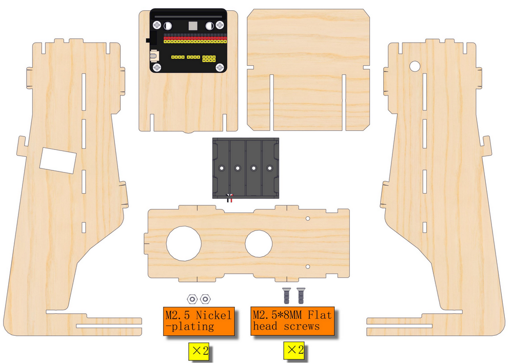
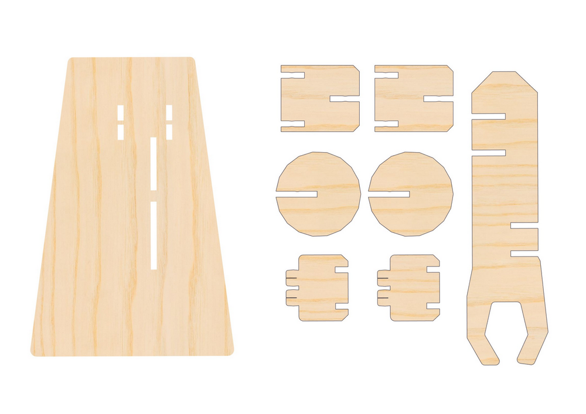

**Thank you for choosing keyestudio!**

**We will endeavor to provide you with better products and services!**

------

**About keyestudio**

Keyestudio is the best-selling brand owned by KEYES Corporation. Our product contains Arduino development and expansion boards, sensors and modules, Raspberry Pi, micro:bit expansion boards as well as smart cars and learning kits, which can help customers at any level to learn about Arduino.

Notably, all of our products are in line with international quality standards and are greatly appreciated in a broad menu of different markets across the world.

Welcome to check out more contents from our official website:

[http://www.keyestudio.com](http://www.keyestudio.com)

------

**Obtain Information and After-sales Service**

Code Download:

[Microbit](Microbit/MakeCode/code.zip)

 [ESP32](ESP32/Code/code.zip)

1. If something is found missing or broken, or you have some difficulty learning the kit, please feel free to contact us. Welcome to send email to us: [service@keyestudio.com](http://m.138.gz.cn/webadmin/~CAmsnCrrNXhTAySKCerrIfWjjZuuWVfI/~/usr/mod_edituser.jsp?;uid=service@keyestudio.com;;clearCache=)

2. We will endeavor to update projects and products continuously from your sincere advice! Thanks!

------

**Warning**

1. This product contains tiny pin headers, so please keep out of reach of children under 7 to prevent from lacerations. 
2. This product also contains conductive parts(control board and electronic modules). Please operate according to the requirements of tutorials. Otherwise, improper operation may damage parts due to overheating. In this case, do not touch it and immediately disconnect the circuit power.

------

**Copyright**

The Keyestudio trademark and logo are the copyright of **KEYES DIY ROBOT co.,LTD**. All products under Keyestudio brand can’t be copied, sold or resold without authorization by anyone or any company. If you are interested in our products, please contact to our sales representatives: [fennie@keyestudio.com](http://m.138.gz.cn/webadmin/~CAmsnCrrNXhTAySKCerrIfWjjZuuWVfI/~/usr/mod_edituser.jsp?;uid=fennie@keyestudio.com;;clearCache=)

------

# STEM Programming DIY Greeting Robot Learning Kit

------

## 1. Kit List

**Please check the list to ensure that all parts are intact. If you find missing ones, please contact our sales staff immediately.**

|  #   |                             PIC                              |       NAME        | QTY  |
| :--: | :----------------------------------------------------------: | :------------: | :----: |
|  1   |                                            |     Expansion board     |   1    |
|  2   |                                            |     Battery holder     |   1    |
|  3   |                                            |     Basswood board     |   1    |
|  4   |                                            |  M4*8MM screw  |   4    |
|  5   |  | M2.5*8MM screw |   2    |
|  6   |  |  M2*8MM screw  |   4    |
|  7   |  |   M1.2*4MM screw   |   4    |
|  8   |  |    M4 nut    |   4    |
|  9   |  | M2.5 nut |   2    |
|  10  |      |    M2 nut    |   4    |
| 11 |  | Servo | 2 |
| 12 |  | Ultrasonic sensor | 1 |
| 13 |  | 4PIN DuPont wire | 1 |
| 14 |  | Screwdriver | 1 |

------

## 2. Description

With bass wood as its structural material, we specially design a greeting robot learning kit.

This kit integrates two servos and an ultrasonic sensor, which are compatible with micro:bit boards and ESP32 Easy Coding Boards. It can detect the distance of objects and wave arms. We write codes via Makecode and KidsBlock to achieve multiple creative and interesting functions.

With this kit, you can master basic sensor knowledge and have an excellent opportunity to learn programming. It is also a perfect combination of learning and entertainment which stimulates your creativity and talent.

------

## 3. Features

1. **Simple assembly:** For convenience, the assembly is easy and simple so that you may complete installations quickly.
2. **Distance detection:** The ultrasonic sensor detects the distance of surrounding obstacles in real time.
3. **Greeting robot:** Two servos control the arms of the robot to perform motions like greeting. Servo angle range is 0~90°.
4. **Modular design:** The robot adopts a modular design, so you can freely combine and replace different modules according to needs for personalized customization.
5. **Multiple programming:** Makecode and KidsBlock programming are available, which meet the diversified programming needs and expand the range of learning.

------

## 4. Assembly

ATTENTION: If you are a beginner, please learn the Micro bit Basic Projects first. The angle of the servo need to be set before assembling. You may not know how to do it without the basic projects.

Click to learn [Basic Projects](#click_jump).

------

**Step 1 Calibrate servo angle**

Wiring:

For MicrobitV2/ESP32 development board, set servo A and B angle to 0°.

[Click to download the servo codes](./servo_code.zip).

After uploading code, the servos rotate to 0°. Disconnect the servos and put them aside, preparing for later installation.

------

**Step2**

------

**Step3**

Wire up the battery holder. Although it is anti-reverse ports, please correspond to positive and negative poles.

|             Expansion board              | Battery holder |
| :--------------------------------------: | :------------: |
|  Battery holder XH2.54 positive (red) +  |    + (red)     |
| Battery holder XH2.54 negative (black) - |   - (black)    |

------

**Step4**

------

**Step5**

------

**Step6**

Wiring:

**Wiring:**

| Ultrasonic sensor | Expansion board |
| :---------------: | :-------------: |
|   ECHO (green)    |     P8/io4      |
|    TRIG (blue)    |    P12/io15     |
|     VCC (red)     |       3V3       |
|    GND (black)    |       GND       |

------

**Step7**

------

**Step8**

------

**Step 9 Wire servos up**

**Servo A:**

| Servo A | Expansion board |
| :-----: | :-------------: |
| yellow  |    P0 / io12    |
|   red   |       3V3       |
|  black  |       GND       |

**Servo B:**

| Servo B | Expansion board |
| :-----: | :-------------: |
| yellow  |    P1 / io14    |
|   red   |       3V3       |
|  black  |       GND       |

------

**Step10**

------

## 5. Resources

[https://www.keyestudio.com/](https://www.keyestudio.com/)

[https://wiki.keyestudio.com/Main_Page](https://wiki.keyestudio.com/Main_Page)

<https://microbit.org/new-microbit/>

[https://www.espressif.com/](https://www.espressif.com/)

------

## 6. Tutorials

Code Downlaod:

[Microbit](Microbit/MakeCode/code.zip)

[ESP32](ESP32/Code/code.zip)

### 1. Basic Projects

<a id="click_jump">Basic Projects:</a>

Basic projects include development board introduction, programming methods, the ways of burning codes and the usage of sensors and modules. You will have a clear understanding on the board functions.

If you are a beginner, please firstly read the introduction and using methods of development board (Micro:bit /ESP32Easy Coding Board) to learn how to program on software and how to upload code.

[Basic Courses:Microbit](Microbit/Basic_Courses.md)

[Basic Courses:ESP32 Easy Coding Board](ESP32/Basic_Courses.md)

### 2. Greeting Robot Projects

Do operations according to the tutorials of the two development boards.

**2.1 Microbit**

[Micro:bit](Microbit/Microbit.md)

**2.2 ESP32 Easy Coding Board**

[ESP32](ESP32/ESP32.md)

------

